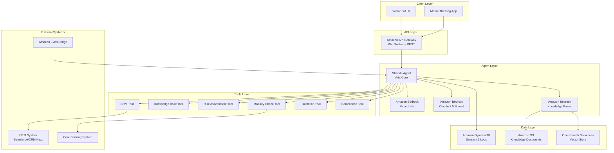
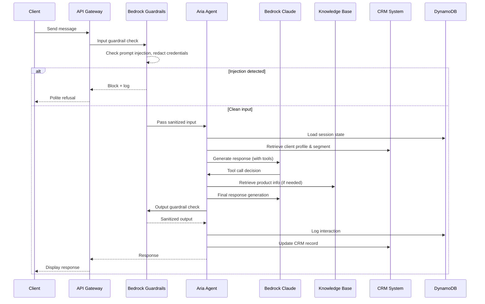

# Design Document: Aria — AI Relationship Manager Agent

## Overview

Aria is an AI-powered Relationship Manager agent built on the **Strands Agents SDK** (Python) with **Amazon Bedrock** as the foundation model provider. The agent serves the Premier/Imperia Banking Division by providing personalized financial advisory, cross-selling, retention management, query resolution, and compliance enforcement for high-value retail and wealth management clients.

### Key Design Decisions

1. **Strands Agents SDK** — Chosen for its open-source, tool-based agent architecture that supports custom tool development, conversation memory, and deployment flexibility (Lambda, Fargate, EC2).
2. **Amazon Bedrock (Claude)** — Foundation model for natural language understanding and generation with built-in safety features.
3. **Amazon Bedrock Guardrails** — Provides prompt injection detection, content filtering, sensitive information redaction (PII, credentials), and denied topic enforcement without custom guardrail code.
4. **Amazon Bedrock Knowledge Bases** — Managed RAG capability for product rate sheets, policies, and documentation retrieval with source attribution.
5. **CRM Integration via API Tools** — The agent connects to CRM (Salesforce/CRM Next) through dedicated Strands tools that read/write client data.
6. **Event-Driven Notifications** — Amazon EventBridge schedules maturity event checks and triggers proactive outreach workflows.

### Technology Stack

| Layer | Technology |
|-------|-----------|
| Agent Framework | Strands Agents SDK (Python) |
| Foundation Model | Amazon Bedrock (Anthropic Claude 3.5 Sonnet) |
| Guardrails | Amazon Bedrock Guardrails |
| Knowledge Base | Amazon Bedrock Knowledge Bases + Amazon OpenSearch Serverless |
| CRM Integration | REST API (Salesforce/CRM Next) via Strands Tools |
| Data Store | Amazon DynamoDB (session state, interaction logs) |
| Event Scheduling | Amazon EventBridge + AWS Lambda |
| Deployment | AWS Lambda (API-backed) or AWS Fargate (long-running sessions) |
| API Gateway | Amazon API Gateway (WebSocket for chat, REST for admin) |
| Observability | Amazon CloudWatch + AWS X-Ray |

## Architecture

### High-Level Architecture



### Request Flow



## Components and Interfaces

### 1. Aria Agent Core (`aria/agent.py`)

The central orchestrator built on Strands SDK that manages the agent loop, tool selection, and conversation flow.

```python
# Agent initialization interface
class AriaAgent:
    def __init__(self, config: AriaConfig):
        """Initialize agent with model, tools, guardrails, and system prompt."""
    
    async def handle_message(self, session_id: str, message: str) -> AgentResponse:
        """Process incoming client message and return response."""
    
    async def handle_proactive_event(self, event: MaturityEvent) -> None:
        """Handle scheduled proactive outreach events."""
```

### 2. Tools

Each tool is a Strands-compatible tool function that the agent can invoke during its reasoning loop.

#### CRM Tool (`aria/tools/crm_tool.py`)

```python
@tool
def read_client_profile(client_id: str) -> ClientProfile:
    """Retrieve client profile including segment flags, accounts, and preferences."""

@tool
def update_client_profile(client_id: str, updates: ProfileUpdate) -> bool:
    """Update client profile with new information or preferences."""

@tool
def log_interaction(client_id: str, summary: InteractionSummary) -> bool:
    """Log interaction summary to CRM with topics, preferences, and follow-ups."""

@tool
def create_followup_reminder(client_id: str, reminder: FollowUpReminder) -> bool:
    """Schedule a follow-up reminder in CRM."""
```

#### Knowledge Base Tool (`aria/tools/knowledge_tool.py`)

```python
@tool
def query_product_info(query: str, product_category: str | None = None) -> KBResponse:
    """Query Knowledge Base for product rates, terms, policies, and documentation."""
```

#### Risk Assessment Tool (`aria/tools/risk_tool.py`)

```python
@tool
def assess_risk_appetite(responses: list[QuestionnaireResponse]) -> RiskProfile:
    """Evaluate client risk appetite from structured questionnaire responses."""

@tool
def get_risk_questionnaire() -> list[RiskQuestion]:
    """Retrieve the risk assessment questionnaire for the client."""
```

#### Maturity and Retention Tool (`aria/tools/maturity_tool.py`)

```python
@tool
def check_upcoming_maturities(client_id: str, days_ahead: int = 30) -> list[MaturityEvent]:
    """Check for deposit/investment maturities within specified timeframe."""

@tool
def detect_large_outflows(client_id: str, threshold_amount: float) -> list[OutflowEvent]:
    """Detect large account outflows above threshold."""
```

#### Compliance Tool (`aria/tools/compliance_tool.py`)

```python
@tool
def check_kyc_status(client_id: str) -> KYCStatus:
    """Verify client's KYC documentation is current."""

@tool
def flag_aml_activity(client_id: str, activity: TransactionActivity) -> AMLFlag:
    """Flag suspicious transaction activity for AML compliance review."""
```

#### Escalation Tool (`aria/tools/escalation_tool.py`)

```python
@tool
def escalate_to_human_rm(
    client_id: str, 
    reason: EscalationReason, 
    context: InteractionContext
) -> EscalationTicket:
    """Escalate case to Human RM with full interaction context."""
```

### 3. Guardrail Configuration (`aria/guardrails/config.py`)

Amazon Bedrock Guardrails configuration for input/output filtering:

```python
class GuardrailConfig:
    content_filters: list[ContentFilter]       # Hate, Insults, Sexual, Violence, Misconduct
    denied_topics: list[DeniedTopic]           # Override attempts, out-of-scope topics
    sensitive_info_filters: list[PIIFilter]    # Credit card, PIN, CVV, OTP, password patterns
    word_filters: list[str]                    # Blocked terms
    prompt_attack_filter: PromptAttackConfig   # Injection detection settings
```

### 4. Session Manager (`aria/session/manager.py`)

Manages conversation state and context across interactions:

```python
class SessionManager:
    async def create_session(self, client_id: str) -> Session:
        """Create new session with client context from CRM."""
    
    async def load_session(self, session_id: str) -> Session:
        """Load existing session state from DynamoDB."""
    
    async def save_session(self, session: Session) -> None:
        """Persist session state to DynamoDB."""
    
    async def end_session(self, session_id: str, summary: InteractionSummary) -> None:
        """End session, log to CRM, and clean up."""
```

### 5. Event Handler (`aria/events/handler.py`)

Processes scheduled events from EventBridge for proactive outreach:

```python
class EventHandler:
    async def handle_maturity_notification(self, event: MaturityEvent) -> None:
        """Process maturity event and initiate proactive client outreach."""
    
    async def handle_outflow_alert(self, event: OutflowEvent) -> None:
        """Process large outflow event and trigger retention workflow."""
```

## Data Models

### Client Profile

```python
@dataclass
class ClientProfile:
    client_id: str
    name: str
    segment: Segment                    # PREMIER | IMPERIA
    segment_flags: list[str]            # e.g., ["HNI", "NRI", "SENIOR_CITIZEN"]
    risk_appetite: RiskLevel | None     # CONSERVATIVE | MODERATE | AGGRESSIVE
    family_members: list[FamilyMember]
    accounts: list[AccountSummary]
    wallet_profile: WalletProfile | None
    kyc_status: KYCStatus
    preferences: ClientPreferences
    created_at: datetime
    updated_at: datetime

class Segment(str, Enum):
    PREMIER = "PREMIER"
    IMPERIA = "IMPERIA"

class RiskLevel(str, Enum):
    CONSERVATIVE = "CONSERVATIVE"
    MODERATE = "MODERATE"
    AGGRESSIVE = "AGGRESSIVE"
```

### Wallet Profile

```python
@dataclass
class WalletProfile:
    external_fds: list[ExternalDeposit]
    external_demat: list[ExternalDematAccount]
    external_insurance: list[ExternalInsurance]
    estimated_external_assets: float
    consolidation_opportunities: list[ConsolidationOpportunity]
    last_updated: datetime

@dataclass
class ConsolidationOpportunity:
    asset_type: str
    current_institution: str
    estimated_value: float
    benefit_description: str
    priority: int  # 1=high, 3=low
```

### Interaction Summary

```python
@dataclass
class InteractionSummary:
    session_id: str
    client_id: str
    timestamp: datetime
    topics_discussed: list[str]
    client_preferences: dict[str, str]
    products_recommended: list[str]
    follow_up_actions: list[FollowUpAction]
    escalation: EscalationTicket | None
    sentiment: str  # POSITIVE | NEUTRAL | NEGATIVE

@dataclass
class FollowUpAction:
    action_type: str
    description: str
    due_date: datetime
    assigned_to: str  # "ARIA" or Human RM identifier
    status: str       # PENDING | COMPLETED | CANCELLED
```

### Maturity Event

```python
@dataclass
class MaturityEvent:
    client_id: str
    account_id: str
    product_type: str          # FD, RD, BOND, MF_SIP
    maturity_date: date
    principal_amount: float
    current_rate: float
    days_until_maturity: int
    reinvestment_options: list[ReinvestmentOption]

@dataclass
class ReinvestmentOption:
    product_name: str
    product_type: str
    current_rate: float
    min_tenure: int
    max_tenure: int
    rate_source_date: date
```

### Escalation Ticket

```python
@dataclass
class EscalationTicket:
    ticket_id: str
    client_id: str
    reason: EscalationReason
    context_summary: str
    interaction_history: list[str]
    priority: str              # HIGH | MEDIUM | LOW
    assigned_to: str | None
    expected_response_time: str
    created_at: datetime
    status: str                # OPEN | IN_PROGRESS | RESOLVED

class EscalationReason(str, Enum):
    HIGH_VALUE_CREDIT = "HIGH_VALUE_CREDIT"
    LEGAL_DISPUTE = "LEGAL_DISPUTE"
    ACCOUNT_FREEZE = "ACCOUNT_FREEZE"
    COMPLEX_FRAUD = "COMPLEX_FRAUD"
    ESTATE_PLANNING = "ESTATE_PLANNING"
    CUSTOM_TREASURY = "CUSTOM_TREASURY"
    UNRESOLVED_QUERY = "UNRESOLVED_QUERY"
```

### Risk Assessment

```python
@dataclass
class RiskQuestion:
    question_id: str
    question_text: str
    options: list[RiskOption]
    weight: float

@dataclass
class RiskOption:
    option_id: str
    option_text: str
    score: int  # 1=conservative, 5=aggressive

@dataclass
class QuestionnaireResponse:
    question_id: str
    selected_option_id: str

@dataclass
class RiskProfile:
    risk_level: RiskLevel
    total_score: int
    max_possible_score: int
    assessment_date: datetime
    suitable_product_categories: list[str]
```

### KYC Status

```python
@dataclass
class KYCStatus:
    is_current: bool
    last_verified: date | None
    expiry_date: date | None
    missing_documents: list[str]
    verification_level: str  # FULL | PARTIAL | EXPIRED | MISSING

@dataclass
class AMLFlag:
    flag_id: str
    client_id: str
    activity_description: str
    risk_score: float
    threshold_breached: str
    flagged_at: datetime
    escalated_to: str
    status: str  # FLAGGED | UNDER_REVIEW | CLEARED | CONFIRMED
```

### Session State

```python
@dataclass
class Session:
    session_id: str
    client_id: str
    client_profile: ClientProfile
    conversation_history: list[Message]
    active_tools: list[str]
    started_at: datetime
    last_activity: datetime
    state: dict  # Flexible key-value state for ongoing workflows

@dataclass
class Message:
    role: str          # "user" | "assistant" | "tool"
    content: str
    timestamp: datetime
    metadata: dict | None
```

### Knowledge Base Response

```python
@dataclass
class KBResponse:
    answer: str
    citations: list[Citation]
    confidence_score: float
    source_date: date | None

@dataclass
class Citation:
    source_document: str
    page_or_section: str
    excerpt: str
    retrieval_score: float
```


## Correctness Properties

*A property is a characteristic or behavior that should hold true across all valid executions of a system — essentially, a formal statement about what the system should do. Properties serve as the bridge between human-readable specifications and machine-verifiable correctness guarantees.*

### Property 1: Client Name Personalization

*For any* client profile with a non-empty name field, all agent responses during that session SHALL contain the client's name at least once.

**Validates: Requirements 1.1, 11.1**

### Property 2: Profile Update Serialization Round Trip

*For any* valid financial profile information provided by a client, serializing it into a `ProfileUpdate` data model and deserializing it back SHALL produce an equivalent data structure with no data loss.

**Validates: Requirements 1.2**

### Property 3: Risk Assessment Precedes Market Recommendations

*For any* agent interaction that results in a Market_Linked_Product recommendation, the risk assessment tool SHALL have been invoked prior to the recommendation in that session's tool call sequence.

**Validates: Requirements 1.3**

### Property 4: CTG Suggestion for Family Accounts

*For any* client profile where `family_members` is non-empty and at least one family member holds an active account, the agent SHALL include a CTG enrollment suggestion in its recommendations.

**Validates: Requirements 1.4**

### Property 5: Wallet Profile Persistence

*For any* external asset disclosure (FD, Demat, insurance), the constructed `WalletProfile` SHALL contain a corresponding entry and the CRM update call SHALL include all disclosed asset details.

**Validates: Requirements 2.1, 2.2**

### Property 6: Product Recommendations Match Client Profile

*For any* client with a determined risk appetite, all recommended investment products SHALL belong to categories appropriate for that risk level (CONSERVATIVE → Fixed Deposits and Government Bonds; MODERATE → balanced mix; AGGRESSIVE → Mutual Fund SIPs and Demat trading).

**Validates: Requirements 3.1, 3.2, 3.3**

### Property 7: Maturity Notification Threshold

*For any* maturity event, the proactive notification SHALL be triggered if and only if `days_until_maturity` is less than or equal to 30.

**Validates: Requirements 4.1**

### Property 8: Outflow Detection Threshold

*For any* account transaction, the retention workflow SHALL be triggered if and only if the transaction amount exceeds the configured large-outflow threshold.

**Validates: Requirements 4.2**

### Property 9: Unresolvable Query Escalation

*For any* client query where the Knowledge Base returns no relevant results (confidence_score below threshold) and the agent cannot resolve from session context, the escalation tool SHALL be called with the full interaction context.

**Validates: Requirements 5.4, 13.2**

### Property 10: Interaction Summary Completeness

*For any* completed client interaction, the logged `InteractionSummary` SHALL contain non-empty `topics_discussed`, the client's `segment_flags`, and a valid `timestamp` (interaction date).

**Validates: Requirements 6.1, 6.2**

### Property 11: Follow-Up Reminder Creation

*For any* interaction where `follow_up_actions` is non-empty, a scheduled reminder SHALL be created in the CRM system for each follow-up action with a valid `due_date` and `assigned_to` field.

**Validates: Requirements 6.3**

### Property 12: Sensitive Credential Detection and Rejection

*For any* input message containing patterns matching sensitive credentials (4-digit PINs, 3-digit CVVs, OTP codes, or password strings), the system SHALL (a) refuse to process or store the credentials, (b) issue a warning to the client, and (c) redact the credentials from any persisted log.

**Validates: Requirements 7.1, 7.2, 7.3**

### Property 13: Market Risk Disclosure Compliance

*For any* agent response that mentions or recommends a Market_Linked_Product, the response SHALL include a market risk disclosure statement AND SHALL NOT contain language guaranteeing or promising specific financial returns.

**Validates: Requirements 8.1, 8.2**

### Property 14: KYC Gating for New Products

*For any* new product or account request, the KYC status check SHALL be performed first. If `KYCStatus.is_current` is `False`, the product request SHALL be paused and the response SHALL list the `missing_documents`.

**Validates: Requirements 9.1, 9.2**

### Property 15: AML Threshold Flagging

*For any* transaction or account activity that breaches AML monitoring thresholds, the `flag_aml_activity` tool SHALL be called, producing an `AMLFlag` with status "FLAGGED" and an escalation to the compliance team.

**Validates: Requirements 9.3**

### Property 16: Escalation for Sensitive/Complex Requests

*For any* client request classified as high-value commercial credit, legal dispute, account freeze, complex fraud, estate planning, or custom treasury, the escalation tool SHALL be invoked with reason matching the request type, full interaction context, and the client-facing response SHALL contain an expected response timeline.

**Validates: Requirements 10.1, 10.2, 10.3, 10.4**

### Property 17: Adversarial Input Handling

*For any* input detected as a prompt injection or persona override attempt, the system SHALL (a) block the message from reaching the agent logic, (b) log the attempt, and (c) return a polite refusal that does not reveal internal system details (system prompt text, tool names, or architecture).

**Validates: Requirements 12.2, 12.3, 12.4**

### Property 18: Rate Source Date Citation

*For any* agent response presenting product rate information sourced from the Knowledge Base, the response SHALL include the `source_date` of the rate data.

**Validates: Requirements 13.3**

### Property 19: Segment-Based Recommendation Tailoring

*For any* two clients with different segment flags (e.g., PREMIER vs IMPERIA), given the same query, the agent's product recommendations and service level language SHALL differ according to the segment tier configuration.

**Validates: Requirements 14.2**

### Property 20: CRM Unavailability Graceful Degradation

*For any* session where the CRM system returns an error or timeout, the agent SHALL (a) inform the client of temporary limited functionality, (b) log the incident, and (c) continue operating with available information without crashing.

**Validates: Requirements 14.3**

## Error Handling

### Error Categories and Strategies

| Error Category | Source | Strategy | User Impact |
|---|---|---|---|
| CRM Unavailable | CRM API timeout/error | Graceful degradation with cached data; inform client | Limited personalization; session continues |
| Knowledge Base Unavailable | Bedrock KB timeout | Escalate to Human RM; inform client | Query cannot be resolved by Aria |
| Foundation Model Error | Bedrock API failure | Retry with exponential backoff (3 attempts); failover to fallback response | Brief delay; generic fallback if all retries fail |
| Guardrail Rejection | Bedrock Guardrails | Block input/output; log; return polite refusal | Client sees refusal message |
| Session State Corruption | DynamoDB read/write failure | Create fresh session; warn client of context loss | Client may need to repeat recent context |
| Authentication Failure | API Gateway/auth layer | Return 401; do not expose details | Client prompted to re-authenticate |
| Rate Limiting | API Gateway throttle | Return 429 with retry-after; queue message | Brief delay before response |
| Tool Execution Failure | Any Strands tool | Catch exception; log; inform agent of tool failure; agent decides next action | Agent may try alternative approach or escalate |

### Error Handling Patterns

#### 1. External Service Failures (CRM, CBS)

```python
class ServiceUnavailableError(AriaError):
    """Raised when an external service is unreachable."""
    service_name: str
    retry_count: int
    last_error: str

async def call_with_retry(func, max_retries=3, backoff_base=1.0):
    """Retry external calls with exponential backoff."""
    for attempt in range(max_retries):
        try:
            return await func()
        except (ConnectionError, TimeoutError) as e:
            if attempt == max_retries - 1:
                raise ServiceUnavailableError(
                    service_name=func.__name__,
                    retry_count=max_retries,
                    last_error=str(e)
                )
            await asyncio.sleep(backoff_base * (2 ** attempt))
```

#### 2. Knowledge Base Fallback

```python
async def query_knowledge_base_with_fallback(query: str) -> KBResponse:
    """Query KB with fallback to escalation."""
    try:
        response = await knowledge_base.retrieve(query)
        if response.confidence_score < CONFIDENCE_THRESHOLD:
            return KBResponse(answer="", citations=[], confidence_score=0.0, source_date=None)
        return response
    except ServiceUnavailableError:
        # Log incident and signal escalation needed
        logger.error("Knowledge Base unavailable", extra={"query": query})
        return KBResponse(answer="", citations=[], confidence_score=0.0, source_date=None)
```

#### 3. Guardrail Processing Errors

```python
async def process_with_guardrails(message: str, guardrail_id: str) -> GuardrailResult:
    """Apply guardrails with safe failure mode (block on error)."""
    try:
        result = await bedrock_guardrails.apply(message, guardrail_id)
        return result
    except Exception as e:
        # Fail closed: if guardrails can't process, block the message
        logger.critical("Guardrail processing failed", extra={"error": str(e)})
        return GuardrailResult(action="BLOCKED", reason="guardrail_processing_error")
```

#### 4. Session Recovery

```python
async def load_or_create_session(session_id: str, client_id: str) -> Session:
    """Load session with recovery fallback."""
    try:
        return await session_manager.load_session(session_id)
    except (ItemNotFoundError, CorruptedStateError):
        logger.warning("Session recovery needed", extra={"session_id": session_id})
        # Create fresh session from CRM data
        return await session_manager.create_session(client_id)
```

### Error Response Templates

All error scenarios produce client-friendly messages that do not expose internal system details:

- **Service degradation**: "I'm experiencing a temporary limitation accessing some of your account details. I can still assist you with general queries. For personalized actions, I'll connect you with your relationship manager."
- **KB miss**: "I don't have the specific information you're looking for in my current resources. Let me connect you with a specialist who can help."
- **Guardrail block**: "I'm not able to process that request. Could you please rephrase your question? I'm here to help with your banking needs."
- **Session timeout**: "It seems our conversation was interrupted. I have your general profile information — could you remind me what we were discussing?"

### Logging and Observability

All errors are logged with structured metadata for observability:

```python
@dataclass
class ErrorLog:
    error_id: str
    timestamp: datetime
    session_id: str
    client_id: str
    error_category: str
    error_message: str
    stack_trace: str | None
    recovery_action: str
    resolved: bool
```

Errors are emitted to CloudWatch Logs with custom metrics for alerting:
- `AriaErrorCount` by category (dimension: error_category)
- `AriaLatencyP99` for response times
- `AriaEscalationCount` for escalation frequency
- `AriaGuardrailBlockCount` for security events

## Testing Strategy

### Testing Approach

The testing strategy employs a dual approach:
- **Property-based tests** validate universal correctness properties across many generated inputs (minimum 100 iterations per property)
- **Unit tests** verify specific examples, edge cases, and integration points
- **Integration tests** verify end-to-end flows with external services

### Property-Based Testing

**Library**: [Hypothesis](https://hypothesis.readthedocs.io/) (Python)

Each correctness property from the design document is implemented as a property-based test with minimum 100 iterations. Tests use the `@given` decorator with custom strategies for generating banking domain data.

**Configuration**:
```python
from hypothesis import given, settings, HealthCheck
from hypothesis import strategies as st

# Base settings for all property tests
PROPERTY_TEST_SETTINGS = settings(
    max_examples=100,
    suppress_health_check=[HealthCheck.too_slow],
    deadline=None  # Allow for async operations with mocks
)
```

**Tag format for property tests**:
```python
# Feature: ai-relationship-manager, Property 12: Sensitive Credential Detection and Rejection
@PROPERTY_TEST_SETTINGS
@given(message=credential_bearing_message_strategy())
def test_credential_detection_and_rejection(message):
    ...
```

**Key Custom Strategies**:
- `client_profile_strategy()` — Generates random `ClientProfile` instances with valid segments, risk levels, and family members
- `wallet_profile_strategy()` — Generates random `WalletProfile` instances with external assets
- `maturity_event_strategy()` — Generates random `MaturityEvent` instances with varying days-until-maturity
- `transaction_strategy()` — Generates random transactions with varying amounts
- `credential_bearing_message_strategy()` — Generates messages containing embedded credential patterns (PINs, CVVs, OTPs)
- `injection_attempt_strategy()` — Generates messages containing common prompt injection patterns
- `risk_questionnaire_response_strategy()` — Generates random questionnaire responses with valid option selections

### Unit Testing

**Framework**: pytest

Unit tests cover:
- Individual tool functions with mocked external dependencies
- Data model serialization/deserialization
- Specific conversation flow examples (greeting, cross-sell, escalation)
- Edge cases: empty profiles, expired KYC, zero-balance accounts
- Output formatting: bullet points, step-by-step instructions
- Tone verification: absence of hard-sell language in example outputs

### Integration Testing

**Framework**: pytest + moto (AWS mocking) + localstack (optional)

Integration tests cover:
- CRM API read/write with realistic payloads
- Knowledge Base retrieval with actual embeddings and source attribution
- Guardrail invocation pipeline (input → guardrails → agent → guardrails → output)
- EventBridge maturity event triggering and Lambda handler invocation
- DynamoDB session persistence round trips
- End-to-end conversation flows (multi-turn with tool calls)

### Test Organization

```
tests/
├── property/                    # Property-based tests (Hypothesis)
│   ├── test_credential_detection.py
│   ├── test_risk_mapping.py
│   ├── test_maturity_threshold.py
│   ├── test_escalation_routing.py
│   ├── test_interaction_logging.py
│   ├── test_kyc_gating.py
│   ├── test_market_disclosure.py
│   └── test_segment_tailoring.py
├── unit/                        # Unit tests (pytest)
│   ├── test_agent_core.py
│   ├── test_crm_tool.py
│   ├── test_knowledge_tool.py
│   ├── test_risk_tool.py
│   ├── test_maturity_tool.py
│   ├── test_compliance_tool.py
│   ├── test_escalation_tool.py
│   ├── test_session_manager.py
│   └── test_data_models.py
├── integration/                 # Integration tests
│   ├── test_crm_integration.py
│   ├── test_kb_integration.py
│   ├── test_guardrail_pipeline.py
│   ├── test_eventbridge_flow.py
│   └── test_end_to_end.py
└── conftest.py                  # Shared fixtures and strategies
```

### Test Coverage Targets

| Category | Target |
|---|---|
| Property tests | 100% of correctness properties covered |
| Unit tests (tools) | 90% line coverage |
| Unit tests (data models) | 100% serialization coverage |
| Integration tests | All critical paths (happy path + primary error paths) |

### CI/CD Integration

- Property tests and unit tests run on every PR (< 5 minutes target)
- Integration tests run nightly against staging environment
- Guardrail and security tests run on every commit to main
- Failed property tests report the minimal failing example for debugging
