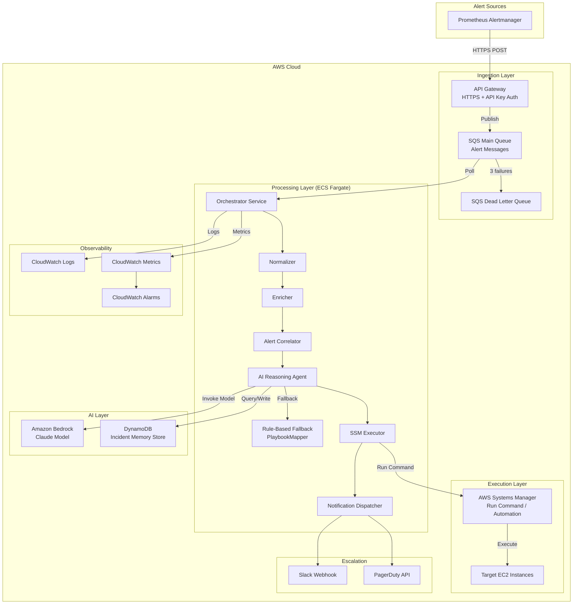
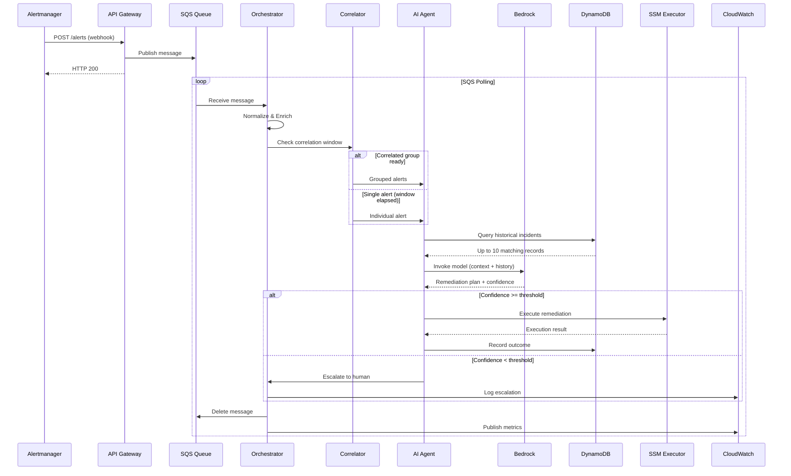

# Design Document: Agentic AI AWS Deployment

## Overview

This design transforms the existing Self-Healing Infrastructure system from a rule-based playbook matching approach into an Agentic AI solution deployed on AWS. The core change replaces the `PlaybookMapper` component with an AI Reasoning Agent powered by Amazon Bedrock that can analyze alerts, correlate patterns across time windows, learn from historical outcomes, and compose remediation strategies.

The system preserves the existing pipeline architecture (normalize → enrich → reason → execute → notify) while replacing the static rule-matching stage with AI-powered reasoning and replacing Ansible subprocess execution with AWS Systems Manager (SSM). The deployment uses AWS CDK for infrastructure-as-code, ECS Fargate for compute, SQS for event-driven ingestion, DynamoDB for incident memory, and CloudWatch for observability.

### Key Design Decisions

1. **Strands Agents SDK for agent orchestration** — Provides tool-use loops, memory retrieval, and structured output parsing with Amazon Bedrock integration out of the box.
2. **SQS over EventBridge** — SQS provides simpler exactly-once processing semantics with built-in DLQ support for alert ingestion at the required 100 msg/s throughput.
3. **DynamoDB for incident memory** — On-demand capacity with TTL handles variable traffic without provisioned capacity cost, and supports the required query patterns (by alert name, severity, service, time range).
4. **SSM Run Command over Ansible** — Native AWS audit trail, IAM-based access control, no SSH key management, and built-in command output capture.
5. **ECS Fargate over Lambda** — The orchestrator needs persistent connections (SQS long-polling, correlation windows) that don't fit Lambda's execution model.
6. **Backward-compatible operating modes** — Three modes (ai_only, rules_only, ai_with_fallback) allow gradual adoption without disrupting existing operations.

## Architecture

### High-Level Architecture



### Pipeline Flow



## Components and Interfaces

### 1. Alert Ingestion Endpoint

**Responsibility:** Receive Prometheus Alertmanager webhooks, validate payloads, and publish to SQS.

```python
class AlertIngestionHandler:
    """API Gateway Lambda or ALB target that validates and enqueues alerts."""
    
    async def handle_webhook(self, request: Request) -> Response:
        """Validate payload and publish to SQS.
        
        - Validates JSON structure and required fields
        - Rejects payloads > 1 MB or invalid JSON with HTTP 400
        - Rejects unauthenticated requests with HTTP 401
        - Publishes valid payloads to SQS main queue
        - Returns HTTP 200 within 2 seconds
        """
        ...
```

### 2. Orchestrator (AWS-Deployed)

**Responsibility:** Poll SQS, coordinate pipeline stages, manage operating modes, expose health/mode APIs.

```python
class AWSOrchestrator:
    """AWS-deployed orchestrator coordinating the full pipeline."""
    
    def __init__(
        self,
        normalizer: Normalizer,
        enricher: Enricher,
        correlator: AlertCorrelator,
        ai_agent: AIReasoningAgent,
        playbook_mapper: PlaybookMapper,
        ssm_executor: SSMExecutor,
        dispatcher: NotificationDispatcher,
        incident_store: IncidentMemoryStore,
        metrics: CloudWatchMetrics,
        config: OrchestratorConfig,
    ) -> None: ...
    
    async def poll_and_process(self) -> None:
        """Main loop: poll SQS, process through pipeline, delete on success."""
        ...
    
    async def process_alert(self, message: SQSMessage) -> None:
        """Process single alert through: normalize → enrich → correlate → reason → execute → notify."""
        ...
    
    @property
    def operating_mode(self) -> OperatingMode:
        """Current operating mode: ai_only, rules_only, or ai_with_fallback."""
        ...
    
    async def set_operating_mode(self, mode: OperatingMode) -> None:
        """Change operating mode at runtime (takes effect on next alert)."""
        ...
```

### 3. Alert Correlator

**Responsibility:** Group related alerts within a configurable time window for joint analysis.

```python
class AlertCorrelator:
    """Groups related alerts within a time window for collective analysis."""
    
    def __init__(self, window_seconds: int = 300) -> None:
        """Initialize with configurable correlation window (30-900 seconds)."""
        ...
    
    async def submit_alert(self, alert: EnrichedAlert) -> Optional[CorrelationGroup]:
        """Submit an alert for correlation.
        
        Returns a CorrelationGroup when:
        - The window elapses for a group with matching labels
        - Maximum group size (50) is reached
        
        Returns None if the alert is buffered awaiting more correlations.
        """
        ...
    
    def _matches_group(self, alert: EnrichedAlert, group: CorrelationGroup) -> bool:
        """Check if alert shares instance, service_name, or location with group."""
        ...
```

### 4. AI Reasoning Agent

**Responsibility:** Invoke Bedrock model with alert context and historical data to produce remediation plans.

```python
class AIReasoningAgent:
    """AI-powered reasoning agent using Amazon Bedrock for remediation decisions."""
    
    def __init__(
        self,
        bedrock_client: BedrockRuntimeClient,
        model_id: str,
        incident_store: IncidentMemoryStore,
        config: AgentConfig,
    ) -> None: ...
    
    async def reason(
        self,
        alerts: list[EnrichedAlert],
        correlation_group: Optional[CorrelationGroup] = None,
    ) -> RemediationPlan:
        """Analyze alerts and produce a remediation plan.
        
        1. Retrieve up to 10 historical incidents matching alert attributes
        2. Construct prompt with alert context + history
        3. Invoke Bedrock model with token budget limits
        4. Parse structured response into RemediationPlan
        5. Apply confidence threshold logic
        6. Handle timeout (30s max) and retry (up to 2 retries)
        
        Falls back to rule-based matching on failure.
        """
        ...
    
    def _build_prompt(
        self,
        alerts: list[EnrichedAlert],
        history: list[IncidentRecord],
    ) -> str:
        """Construct the model prompt with alert context and historical data."""
        ...
    
    def _parse_response(self, response: dict) -> RemediationPlan:
        """Parse Bedrock model response into structured RemediationPlan."""
        ...
```

### 5. Incident Memory Store

**Responsibility:** Persist and query historical incident records in DynamoDB.

```python
class IncidentMemoryStore:
    """DynamoDB-backed store for historical incident records and outcomes."""
    
    def __init__(self, table_name: str, dynamodb_client: DynamoDBClient) -> None: ...
    
    async def record_incident(self, record: IncidentRecord) -> None:
        """Write incident record with TTL-based expiry."""
        ...
    
    async def query_history(
        self,
        alert_name: Optional[str] = None,
        severity: Optional[str] = None,
        service: Optional[str] = None,
        limit: int = 10,
    ) -> list[IncidentRecord]:
        """Query historical incidents ordered by recency.
        
        Matches on at least one of: alert_name, severity, service.
        Returns up to `limit` records, most recent first.
        Timeout: 5 seconds.
        """
        ...
    
    async def record_outcome(self, incident_id: str, outcome: RemediationOutcome) -> None:
        """Record remediation outcome within 5 seconds of completion."""
        ...
```

### 6. SSM Executor

**Responsibility:** Execute remediation actions via AWS Systems Manager Run Command.

```python
class SSMExecutor:
    """Executes remediation via AWS Systems Manager Run Command."""
    
    MAX_CONCURRENT = 10
    MAX_PARAM_SIZE = 32_000
    MAX_OUTPUT_LENGTH = 10_000
    
    def __init__(self, ssm_client: SSMClient, timeout: int = 300) -> None:
        """Initialize with configurable timeout (30-3600 seconds)."""
        ...
    
    async def execute(self, plan: RemediationPlan) -> ExecutionResult:
        """Execute remediation plan steps sequentially.
        
        - Validates parameter payload size (< 32,000 chars)
        - Checks instance SSM prerequisites before execution
        - Executes steps sequentially, aborting on failure
        - Captures output (truncated to 10,000 chars)
        - Retries SSM API failures up to 2 times with exponential backoff
        - Supports up to 10 concurrent executions via semaphore
        """
        ...
    
    async def _check_prerequisites(self, instance_id: str) -> PrerequisiteResult:
        """Check SSM registration, online status, and IAM role."""
        ...
    
    async def _execute_step(self, step: RemediationStep) -> StepResult:
        """Execute a single remediation step via SSM Run Command."""
        ...
```

### 7. CloudWatch Metrics Publisher

**Responsibility:** Publish custom metrics and structured logs to CloudWatch.

```python
class CloudWatchMetrics:
    """Publishes custom metrics and structured logs to CloudWatch."""
    
    def __init__(self, namespace: str, cloudwatch_client: CloudWatchClient) -> None: ...
    
    async def record_alert_received(self, alert_name: str, severity: str) -> None: ...
    async def record_reasoning_latency(self, duration_ms: float) -> None: ...
    async def record_reasoning_invocation(self, model_id: str, tokens_in: int, tokens_out: int) -> None: ...
    async def record_fallback(self, reason: str) -> None: ...
    async def record_remediation_result(self, status: str, duration_s: float) -> None: ...
    async def record_escalation(self, severity: str, confidence: float) -> None: ...
    async def record_bedrock_cost_estimate(self, tokens_in: int, tokens_out: int, model_id: str) -> None: ...
```

### 8. Escalation Manager

**Responsibility:** Handle human escalation workflow including notifications, timeouts, and responses.

```python
class EscalationManager:
    """Manages human escalation workflow for low-confidence decisions."""
    
    def __init__(
        self,
        dispatcher: NotificationDispatcher,
        incident_store: IncidentMemoryStore,
        config: EscalationConfig,
    ) -> None: ...
    
    async def escalate(self, incident_id: str, plan: RemediationPlan) -> None:
        """Dispatch escalation notification and pause remediation.
        
        - Sends to Slack/PagerDuty within 30 seconds
        - Records escalation in incident store
        - Retries delivery up to 3 times at 10-second intervals
        """
        ...
    
    async def handle_response(self, incident_id: str, response: HumanResponse) -> None:
        """Process human response: approve, reject with alternative, or reject."""
        ...
    
    async def check_timeout(self, incident_id: str) -> None:
        """Check if escalation timeout has expired and take appropriate action.
        
        - If confidence > 0.3: execute AI-suggested remediation
        - If confidence <= 0.3: mark unresolved, send follow-up notification
        """
        ...
```

## Data Models

### Core Domain Models (Extensions to Existing)

```python
from dataclasses import dataclass, field
from datetime import datetime
from enum import Enum
from typing import Optional


class OperatingMode(Enum):
    """System operating mode."""
    AI_ONLY = "ai_only"
    RULES_ONLY = "rules_only"
    AI_WITH_FALLBACK = "ai_with_fallback"


class EscalationStatus(Enum):
    """Escalation lifecycle status."""
    PENDING = "pending"
    APPROVED = "approved"
    REJECTED = "rejected"
    TIMED_OUT_EXECUTED = "timed_out_executed"
    TIMED_OUT_UNRESOLVED = "timed_out_unresolved"


class FallbackReason(Enum):
    """Reason for falling back to rule-based matching."""
    THROTTLING = "throttling"
    TIMEOUT = "timeout"
    SERVICE_ERROR = "service_error"
    REASONING_TIMEOUT = "reasoning_timeout"


@dataclass
class RemediationStep:
    """A single step in a multi-step remediation plan."""
    step_number: int
    action: str  # SSM document name or command
    target_resource: str  # EC2 instance ID or resource ARN
    parameters: dict[str, str] = field(default_factory=dict)
    expected_outcome: str = ""


@dataclass
class RemediationPlan:
    """Structured output from the AI Reasoning Agent."""
    incident_ids: list[str]  # All correlated incident IDs addressed
    steps: list[RemediationStep]  # Max 20 steps
    confidence_score: float  # 0.0 to 1.0
    reasoning_explanation: str  # Max 2048 characters
    selected_action: str  # Primary remediation action name
    target_resource: str  # Primary target resource
    requires_escalation: bool = False
    fallback_used: bool = False
    fallback_reason: Optional[FallbackReason] = None
    truncation_flag: bool = False


@dataclass
class CorrelationGroup:
    """A group of correlated alerts within a time window."""
    group_id: str
    alerts: list[EnrichedAlert]  # Max 50
    common_labels: dict[str, str]  # Shared label values
    window_start: datetime
    window_end: datetime


@dataclass
class IncidentRecord:
    """Historical incident record stored in DynamoDB."""
    incident_id: str
    alert_name: str
    severity: str
    affected_service: str
    affected_resource: str
    remediation_action: str
    outcome: str  # success, failure, timeout
    execution_duration_seconds: float
    timestamp_completed: datetime
    expiry_timestamp: int  # Unix epoch for DynamoDB TTL
    
    # AI-specific fields
    model_id: Optional[str] = None
    input_token_count: Optional[int] = None
    output_token_count: Optional[int] = None
    reasoning_latency_ms: Optional[float] = None
    confidence_score: Optional[float] = None
    reasoning_summary: str = ""
    
    # Escalation fields
    escalation_status: Optional[EscalationStatus] = None
    escalation_responder: Optional[str] = None
    escalation_response_timestamp: Optional[datetime] = None
    
    # Fallback tracking
    fallback_used: bool = False
    fallback_reason: Optional[str] = None


@dataclass
class HumanResponse:
    """Human response to an escalation."""
    action: str  # "approve", "reject_with_alternative", "reject"
    responder_identity: str
    timestamp: datetime
    alternative_action: Optional[str] = None


@dataclass
class PrerequisiteResult:
    """Result of SSM prerequisite checks."""
    is_ready: bool
    registration_status: bool
    online_status: bool
    iam_role_attached: bool
    error_message: str = ""


@dataclass
class AgentConfig:
    """Configuration for the AI Reasoning Agent."""
    model_id: str
    max_input_tokens: int = 4000  # Range: 1000-16000
    max_output_tokens: int = 1000  # Range: 200-4000
    reasoning_timeout_seconds: int = 30
    retry_count: int = 2
    retry_backoff_base_seconds: float = 1.0
    escalation_threshold: float = 0.5  # Range: 0.1-0.9
    p1_minimum_confidence: float = 0.8
    correlation_window_seconds: int = 300  # Range: 30-900
    history_retention_days: int = 90  # Range: 7-365


@dataclass
class OrchestratorConfig:
    """Configuration for the AWS Orchestrator."""
    operating_mode: OperatingMode = OperatingMode.RULES_ONLY
    sqs_queue_url: str = ""
    sqs_visibility_timeout: int = 60
    escalation_timeout_minutes: int = 30  # Range: 5-120
    health_check_interval_seconds: int = 30
    redaction_patterns: list[str] = field(
        default_factory=lambda: ["password", "secret", "token", "key"]
    )
```

### DynamoDB Table Schema

**Table: IncidentMemoryStore**

| Attribute | Type | Key | Description |
|-----------|------|-----|-------------|
| incident_id | String | Partition Key | Unique incident identifier |
| timestamp_completed | Number | Sort Key | Unix epoch timestamp |
| alert_name | String | GSI-1 PK | Alert name for querying |
| severity | String | GSI-1 SK | Severity level |
| affected_service | String | GSI-2 PK | Service name for querying |
| affected_resource | String | — | Target resource identifier |
| remediation_action | String | — | Action taken |
| outcome | String | GSI-3 PK | success/failure/timeout |
| execution_duration_seconds | Number | — | Duration of execution |
| expiry_timestamp | Number | TTL | Auto-expiry timestamp |
| model_id | String | — | Bedrock model used |
| input_token_count | Number | — | Tokens sent to model |
| output_token_count | Number | — | Tokens received from model |
| reasoning_latency_ms | Number | — | AI reasoning duration |
| confidence_score | Number | — | AI confidence (0.0-1.0) |
| reasoning_summary | String | — | AI reasoning text (max 2048) |
| escalation_status | String | — | Escalation lifecycle state |
| fallback_used | Boolean | — | Whether fallback was triggered |
| fallback_reason | String | — | Reason for fallback |

**Global Secondary Indexes:**
- **GSI-1 (AlertNameIndex):** PK=alert_name, SK=timestamp_completed — Query by alert name ordered by time
- **GSI-2 (ServiceIndex):** PK=affected_service, SK=timestamp_completed — Query by service ordered by time
- **GSI-3 (OutcomeIndex):** PK=outcome, SK=timestamp_completed — Query by outcome for analytics

## Correctness Properties

*A property is a characteristic or behavior that should hold true across all valid executions of a system — essentially, a formal statement about what the system should do. Properties serve as the bridge between human-readable specifications and machine-verifiable correctness guarantees.*

### Property 1: Prompt Construction Completeness

*For any* valid enriched alert and any set of historical incidents (0 to 50 records), the prompt constructed by the AI Reasoning Agent SHALL contain all required context fields (alert name, severity, labels, annotations, enrichment data) and include at most 50 historical incidents.

**Validates: Requirements 1.1**

### Property 2: Remediation Plan Structure Validity

*For any* valid model response parsed by the AI Reasoning Agent, the resulting RemediationPlan SHALL contain a non-empty selected action, a non-empty target resource identifier, a confidence score in the range [0.0, 1.0], and a reasoning explanation of at most 2048 characters.

**Validates: Requirements 1.2**

### Property 3: Confidence-Based Escalation Decision

*For any* confidence score and escalation threshold (in range [0.1, 0.9]), the RemediationPlan's `requires_escalation` flag SHALL be true when confidence < threshold; additionally, *for any* P1 severity alert, escalation SHALL occur when confidence < 0.8 regardless of the general threshold.

**Validates: Requirements 1.3, 8.3**

### Property 4: Fallback Event Recording

*For any* fallback event triggered by the AI Reasoning Agent, the recorded event in the Incident Memory Store SHALL contain a valid fallback reason from the set {throttling, timeout, service_error, reasoning_timeout} that matches the actual failure condition.

**Validates: Requirements 1.6**

### Property 5: Alert Correlation Grouping

*For any* set of enriched alerts arriving within the correlation window, alerts SHALL be grouped into correlation groups where every pair of alerts in the same group shares at least one common label value among {instance, service_name, location}, and no group SHALL exceed 50 alerts.

**Validates: Requirements 2.1**

### Property 6: Correlation Group ID Completeness

*For any* correlation group processed by the AI Reasoning Agent, the resulting RemediationPlan's `incident_ids` list SHALL contain exactly the set of incident IDs from all alerts in the correlation group.

**Validates: Requirements 2.3**

### Property 7: Correlation Window Configuration Validation

*For any* environment variable value provided for the Alert Correlation Window, the effective window SHALL be 300 seconds if the value is not a valid integer, below 30, or above 900; otherwise the effective window SHALL equal the provided value.

**Validates: Requirements 2.5, 2.6**

### Property 8: Historical Query Result Ordering and Limits

*For any* query to the Incident Memory Store matching on alert name, severity, or service, the returned results SHALL contain at most 10 records, each matching on at least one of the query attributes, ordered by timestamp descending (most recent first).

**Validates: Requirements 3.2**

### Property 9: Historical Context in Prompt

*For any* set of historical incidents retrieved for prompt construction, the prompt SHALL cite the correct count of past successes and past failures for the selected remediation action against similar alerts.

**Validates: Requirements 3.3**

### Property 10: TTL Expiry Calculation

*For any* incident record stored with a retention period in [7, 365] days, the `expiry_timestamp` attribute SHALL equal the completion timestamp plus (retention_days × 86400) seconds.

**Validates: Requirements 3.4**

### Property 11: Historical Failure Exclusion

*For any* alert name where all historical attempts of a specific remediation action resulted in failure, the AI Reasoning Agent SHALL exclude that action from the RemediationPlan and indicate the exclusion in the reasoning explanation.

**Validates: Requirements 3.6**

### Property 12: SSM Parameter Payload Size Validation

*For any* remediation plan, if the serialized alert context parameters exceed 32,000 characters, the SSM Executor SHALL block execution and mark the remediation as failed; if the payload is within the limit, execution SHALL proceed.

**Validates: Requirements 4.2**

### Property 13: SSM Output Truncation

*For any* SSM command output, the captured result SHALL be at most 10,000 characters and SHALL preserve the leading prefix of the original output.

**Validates: Requirements 4.3**

### Property 14: SSM Prerequisite Error Reporting

*For any* combination of SSM prerequisite states (registration, online, IAM role), when the target instance is not reachable, the error message SHALL identify the specific prerequisite that failed.

**Validates: Requirements 4.5**

### Property 15: Sequential Step Execution with Abort on Failure

*For any* remediation plan with N steps (1 ≤ N ≤ 20) where step K fails (1 ≤ K ≤ N), steps 1 through K SHALL have been executed, steps K+1 through N SHALL be skipped, and the overall remediation SHALL be marked as failed indicating which step failed and how many steps were skipped.

**Validates: Requirements 4.8**

### Property 16: Invalid Payload Rejection

*For any* HTTP request payload that is not valid JSON, exceeds 1 MB, or is missing required fields (alerts array with alertname and severity), the Alert Ingestion Endpoint SHALL respond with HTTP 400 and SHALL NOT enqueue the payload.

**Validates: Requirements 5.7**

### Property 17: Structured Log Format

*For any* processed alert, the emitted log entry SHALL be valid JSON containing all required fields: incident_id, pipeline_stage, duration, outcome, and AI reasoning summary.

**Validates: Requirements 7.2**

### Property 18: Post-Timeout Escalation Behavior

*For any* escalated incident where the escalation timeout expires without human response: if the confidence score is above 0.3, the AI-suggested remediation SHALL be executed; if the confidence score is 0.3 or below, the incident SHALL be marked as unresolved and no automated remediation SHALL execute.

**Validates: Requirements 8.5, 8.6**

### Property 19: Human Response Recording

*For any* human response to an escalation (approve, reject with alternative, or reject without alternative), the Incident Memory Store record SHALL contain the action taken, responder identity, and response timestamp.

**Validates: Requirements 8.7**

### Property 20: Operating Mode Routing

*For any* alert processed in "rules_only" mode, the AI Reasoning Agent SHALL NOT be invoked and the PlaybookMapper SHALL be used directly; *for any* alert in "ai_only" mode, the PlaybookMapper SHALL NOT be used for primary matching.

**Validates: Requirements 9.1, 9.4**

### Property 21: Mode Change Validation

*For any* value submitted to the runtime mode-change API that is not one of {"ai_only", "rules_only", "ai_with_fallback"}, the request SHALL be rejected and the current operating mode SHALL remain unchanged.

**Validates: Requirements 9.6**

### Property 22: Sensitive Label Redaction

*For any* alert label whose value contains a substring matching any configured redaction pattern (case-insensitive match for "password", "secret", "token", or "key"), the stored value in DynamoDB SHALL be replaced with the fixed placeholder string; non-matching label values SHALL be preserved unchanged.

**Validates: Requirements 10.6**

### Property 23: Incident Record Completeness

*For any* completed incident, the record stored in the Incident Memory Store SHALL contain all required fields: incident ID, alert name, severity, affected resource, timestamp received, AI reasoning summary (max 2048 chars), confidence score, selected action, execution result, and notification status.

**Validates: Requirements 11.1**

### Property 24: Audit Event JSON Format

*For any* incident record creation, the corresponding audit event published to CloudWatch Logs SHALL be a single valid JSON object containing all fields from the incident record.

**Validates: Requirements 11.2**

### Property 25: AI Decision Audit Fields

*For any* AI reasoning decision, the audit record SHALL include the model ID used, input token count, output token count, and reasoning latency in milliseconds.

**Validates: Requirements 11.3**

### Property 26: Token Budget Enforcement

*For any* prompt constructed by the AI Reasoning Agent, the input token count SHALL not exceed the configured maximum (default 4000, range 1000-16000), achieved by truncating historical context prioritized by recency first and then by similarity to the current alert.

**Validates: Requirements 12.1, 12.2**

### Property 27: Truncation Flag on Token Limit

*For any* Bedrock model response that reaches the configured maximum output token count, the RemediationPlan SHALL have the `truncation_flag` set to true, regardless of whether actual content was removed by the truncation.

**Validates: Requirements 12.6**

## Error Handling

### Failure Modes and Recovery Strategies

| Component | Failure Mode | Recovery Strategy | Requirement |
|-----------|-------------|-------------------|-------------|
| Bedrock Model | Throttling/timeout/error | Retry 2x with exponential backoff (1s base), then fall back to rule-based mapper | 1.4 |
| Bedrock Model | Reasoning exceeds 30s | Abort and fall back to rule-based mapper | 1.5 |
| Bedrock Model | Content filtering/incomplete | Treat as failure, invoke rule-based fallback | 12.7 |
| Incident Memory Store | Unreachable during history retrieval | Proceed with current alert context only, log warning | 1.7, 3.5 |
| Incident Memory Store | Write failure for outcome | Retry 3x with exponential backoff, publish failure metric | 11.6 |
| Incident Memory Store | Unreachable during fallback recording | Log to application logs, publish CloudWatch metric | 1.6 |
| SSM API | Throttling/access denied/error | Retry 2x with exponential backoff (1s base), mark failed | 4.6 |
| SSM Execution | Timeout (configurable, default 300s) | Cancel command, mark as timed-out, capture partial output | 4.4 |
| SSM Target | Instance not reachable | Check prerequisites individually, report specific failure | 4.5 |
| SSM Execution | Step failure in multi-step plan | Abort remaining steps, mark overall as failed | 4.8 |
| SQS Processing | Message processing failure | Return to queue for retry; after 3 failures → DLQ | 5.5 |
| Escalation Notification | Delivery failure | Retry 3x at 10-second intervals, then mark for manual review | 8.8 |
| Audit Write | DynamoDB/CloudWatch failure | Retry 3x with exponential backoff, publish failure notification | 11.6 |
| Truncation Mechanism | Failure during truncation | Return partial response without truncation flag | 12.8 |
| Alert Ingestion | Invalid payload | HTTP 400, discard without enqueuing | 5.7 |
| Alert Ingestion | Unauthorized request | HTTP 401, log attempt with source IP | 10.5 |
| Configuration | Invalid correlation window | Default to 300 seconds, log warning | 2.6 |
| Configuration | Invalid escalation threshold | Default to 0.5, log warning | 8.2 |
| Configuration | Invalid operating mode | Default to "rules_only", log warning | 9.1 |
| YAML Config | Validation failure on startup | Refuse to start in rules_only/ai_with_fallback modes | 9.3 |

### Circuit Breaker Pattern

The AI Reasoning Agent implements a lightweight circuit breaker:
- **Closed (normal):** AI reasoning processes alerts normally
- **Open (fallback):** After consecutive failures exceed threshold, route directly to rule-based fallback for a cooldown period
- **Half-open (probe):** After cooldown, attempt AI reasoning on next alert to test recovery

### Graceful Degradation Hierarchy

1. **Full AI mode:** AI reasoning with historical context
2. **AI without history:** AI reasoning with current alert only (memory store unavailable)
3. **Rule-based fallback:** Static playbook matching (AI unavailable)
4. **Manual escalation:** Human notification (all automation unavailable)

## Testing Strategy

### Testing Approach

The testing strategy uses a dual approach combining property-based tests for universal correctness guarantees with example-based unit tests for specific scenarios and integration tests for AWS service interactions.

### Property-Based Testing

**Library:** [Hypothesis](https://hypothesis.readthedocs.io/) (Python) — already used in the existing test suite.

**Configuration:**
- Minimum 100 iterations per property test
- Each property test references its design document property
- Tag format: `Feature: agentic-ai-aws-deployment, Property {number}: {property_text}`

**Property tests cover:**
- Prompt construction and token budget management (Properties 1, 9, 26)
- Response parsing and plan validation (Properties 2, 27)
- Confidence-based decision logic (Properties 3, 18)
- Alert correlation grouping algorithm (Properties 5, 6)
- Configuration validation (Properties 7, 20, 21)
- Historical query behavior (Properties 8, 10, 11)
- SSM execution logic (Properties 12, 13, 14, 15)
- Input validation (Property 16)
- Data redaction (Property 22)
- Record completeness (Properties 23, 24, 25)
- Log format validation (Property 17)
- Fallback recording (Property 4)
- Human response handling (Property 19)

### Unit Tests (Example-Based)

Unit tests cover specific scenarios not suited for property-based testing:

- Bedrock retry behavior with mocked failures (Req 1.4)
- Timeout enforcement at 30 seconds (Req 1.5)
- Memory store unavailability graceful degradation (Req 1.7, 3.5)
- Single alert processing after correlation window (Req 2.4)
- YAML configuration validation on startup (Req 9.3)
- Health check endpoint with various dependency states (Req 7.5)
- Unauthorized request handling (Req 10.5)
- Content-filtered Bedrock response handling (Req 12.7)
- Truncation mechanism failure (Req 12.8)

### Integration Tests

Integration tests verify AWS service interactions:

- SQS message lifecycle (publish, process, delete, DLQ routing)
- DynamoDB read/write operations and TTL behavior
- SSM Run Command invocation and output capture
- CloudWatch metric publishing and log delivery
- API Gateway authentication and routing
- ECS task health checks and auto-scaling triggers
- End-to-end pipeline processing from webhook to remediation

### CDK Assertion Tests

Infrastructure tests using CDK assertions:

- Resource creation (ECS, SQS, DynamoDB, IAM, VPC, CloudWatch)
- IAM policy least-privilege verification
- Encryption configuration (KMS, SSE-SQS, log encryption)
- Network topology (private subnets, NAT Gateway)
- Auto-scaling configuration
- Alarm thresholds
- Tag propagation
- Parameter validation (required params, valid ranges)

### Test Organization

```
tests/
├── property/
│   ├── test_prompt_construction.py      # Properties 1, 9, 26
│   ├── test_plan_validation.py          # Properties 2, 27
│   ├── test_confidence_decisions.py     # Properties 3, 18
│   ├── test_correlation.py             # Properties 5, 6, 7
│   ├── test_history_queries.py         # Properties 8, 10, 11
│   ├── test_ssm_execution.py           # Properties 12, 13, 14, 15
│   ├── test_input_validation.py        # Property 16
│   ├── test_redaction.py               # Property 22
│   ├── test_record_completeness.py     # Properties 23, 24, 25
│   ├── test_mode_routing.py            # Properties 20, 21
│   ├── test_log_format.py             # Property 17
│   ├── test_fallback_recording.py      # Property 4
│   └── test_human_response.py          # Property 19
├── unit/
│   ├── test_ai_agent_retry.py
│   ├── test_ai_agent_timeout.py
│   ├── test_graceful_degradation.py
│   ├── test_correlation_window.py
│   ├── test_yaml_validation.py
│   ├── test_health_check.py
│   ├── test_auth_handling.py
│   └── test_truncation_errors.py
├── integration/
│   ├── test_sqs_lifecycle.py
│   ├── test_dynamodb_operations.py
│   ├── test_ssm_execution.py
│   ├── test_cloudwatch_publishing.py
│   ├── test_api_gateway.py
│   └── test_end_to_end_pipeline.py
└── cdk/
    ├── test_stack_resources.py
    ├── test_iam_policies.py
    ├── test_encryption.py
    ├── test_networking.py
    └── test_parameters.py
```

