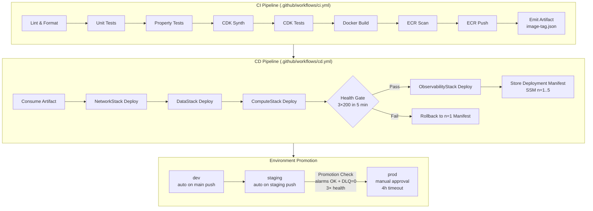
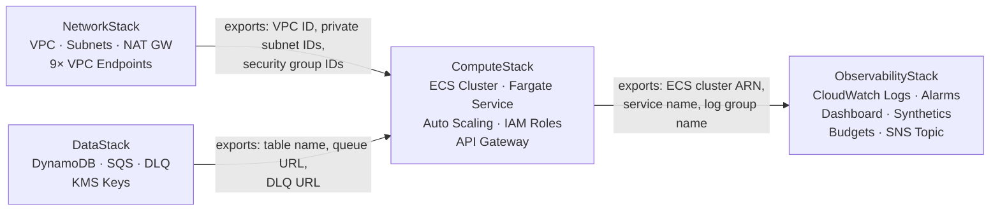

# Design Document: AWS Deployment Plan

## Overview

This document describes the technical design for end-to-end deployment of the AIOps Self-Healing Infrastructure application on AWS. The deployment system turns the existing FastAPI/Ansible application (packaged in a `python:3.11-slim` Docker image) into a production-grade, continuously-deployed service running on ECS Fargate.

The deployment system is responsible for five concerns:

1. **Image lifecycle** — reproducible Docker builds pushed to ECR with vulnerability scanning and immutable tags
2. **Infrastructure-as-code** — four layered CDK stacks that provision all AWS resources from a single parameterized CDK app
3. **CI/CD automation** — GitHub Actions workflows that enforce quality gates, OIDC-based AWS authentication, and environment promotion
4. **Configuration and secrets** — SSM Parameter Store for runtime config, Secrets Manager for credentials, loaded at task startup and refreshed in-process
5. **Operations** — health gates, automated rollback, runbooks, CloudWatch dashboards, and cost controls

The application itself (`src/app.py`) does not change. The deployment system wraps it with AWS infrastructure so that its `/webhook`, `/health`, and `/metrics` endpoints are reachable through API Gateway, backed by an SQS-triggered processing pipeline on ECS Fargate.


## Architecture Diagram

### CI → CD Flow and Stack Dependency Chain



### CDK Stack Dependency Graph




## CDK Stack Structure

### File Layout under `src/agentic_ai/infra/`

```
src/agentic_ai/infra/
├── __init__.py
├── app.py                      # CDK App entry point; reads CDK_Context, instantiates stacks
├── context.py                  # CdkContext dataclass + validate_cdk_context()
├── tags.py                     # apply_standard_tags() helper used by every stack
├── stacks/
│   ├── __init__.py
│   ├── network_stack.py        # NetworkStack class
│   ├── data_stack.py           # DataStack class
│   ├── compute_stack.py        # ComputeStack class
│   └── observability_stack.py  # ObservabilityStack class
└── constructs/
    ├── __init__.py
    ├── vpc_endpoints.py        # VpcEndpoints construct (9 endpoints)
    ├── ecs_service.py          # AiopsEcsService construct
    ├── config_loader.py        # ConfigLoader class (SSM + Secrets Manager)
    └── health_gate.py          # HealthGateChecker class
```

Supporting files outside `infra/`:

```
cdk.json                        # CDK app entry point + default context values
cdk.context.json                # .gitignore'd; holds synthesized context cache
Makefile                        # targets: deploy, diff, rollback, destroy
tests/cdk/
├── __init__.py
├── conftest.py                 # shared CDK app + stack fixtures
├── test_network_stack.py
├── test_data_stack.py
├── test_compute_stack.py
└── test_observability_stack.py
```

### Class Names and Cross-Stack References

Each stack exports values via `CfnOutput` and receives them via constructor parameters (not `Fn.import_value`, to keep stacks independently deployable):

```python
# network_stack.py
class NetworkStack(Stack):
    vpc: ec2.Vpc
    private_subnets: list[ec2.Subnet]
    ecs_security_group: ec2.SecurityGroup

# data_stack.py
class DataStack(Stack):
    table: dynamodb.Table
    queue: sqs.Queue
    dlq: sqs.Queue

# compute_stack.py  — receives network_stack and data_stack instances
class ComputeStack(Stack):
    cluster: ecs.Cluster
    service: ecs.FargateService
    task_role: iam.Role
    execution_role: iam.Role
    log_group: logs.LogGroup

# observability_stack.py  — receives compute_stack instance
class ObservabilityStack(Stack):
    alarm_topic: sns.Topic
    dashboard: cloudwatch.Dashboard
```

### `cdk.json` Entry Point

```json
{
  "app": "python src/agentic_ai/infra/app.py",
  "context": {
    "environment": "dev",
    "awsAccount": "123456789012",
    "awsRegion": "us-east-1",
    "bedrockModelId": "anthropic.claude-3-sonnet-20240229-v1:0",
    "costCenter": "platform-engineering",
    "costCenterEmail": "platform@example.com",
    "vpcCidr": "10.0.0.0/16",
    "monthlyBudgetUsd": "200"
  }
}
```


## NetworkStack Design

### VPC Layout

| Resource | Detail |
|---|---|
| CIDR | `10.0.0.0/16` (CDK_Context `vpcCidr`, default) |
| Availability Zones | `us-east-1a`, `us-east-1b` (2 AZs) |
| Public subnets | `10.0.0.0/24` (AZ-a), `10.0.1.0/24` (AZ-b) |
| Private subnets | `10.0.10.0/24` (AZ-a), `10.0.11.0/24` (AZ-b) |
| NAT Gateway | 1× in public subnet AZ-a (cost-optimized; dev only uses one AZ) |
| Internet Gateway | 1× attached to VPC |

ECS tasks run in private subnets. All outbound internet traffic routes through the single NAT Gateway. VPC endpoints bypass NAT for AWS service traffic.

### VPC Endpoints

| Endpoint | Type | Service |
|---|---|---|
| S3 | Gateway | `com.amazonaws.{region}.s3` |
| DynamoDB | Gateway | `com.amazonaws.{region}.dynamodb` |
| ECR API | Interface | `com.amazonaws.{region}.ecr.api` |
| ECR DKR | Interface | `com.amazonaws.{region}.ecr.dkr` |
| SQS | Interface | `com.amazonaws.{region}.sqs` |
| SSM | Interface | `com.amazonaws.{region}.ssm` |
| Secrets Manager | Interface | `com.amazonaws.{region}.secretsmanager` |
| CloudWatch Logs | Interface | `com.amazonaws.{region}.logs` |
| Bedrock Runtime | Interface | `com.amazonaws.{region}.bedrock-runtime` |

Gateway endpoints are free and route via the route table. Interface endpoints each create an ENI in the private subnets.

### Security Groups

**`ecs-tasks-sg`** (attached to ECS Fargate tasks):
- Inbound: None (SQS polling is outbound; API Gateway uses VPC Link which is separate)
- Outbound: HTTPS (443) to `0.0.0.0/0` (through NAT or VPC endpoints)

**`vpc-endpoints-sg`** (attached to all Interface VPC endpoints):
- Inbound: HTTPS (443) from `ecs-tasks-sg`
- Outbound: None required

**`api-gateway-vpc-link-sg`** (for API Gateway VPC Link, if NLB is used):
- Inbound: HTTP (8080) from API Gateway managed prefix list
- Outbound: HTTP (8080) to `ecs-tasks-sg`

Design rationale: No `0.0.0.0/0` inbound rules anywhere. ECS tasks are not directly reachable from the internet.

```python
# vpc_endpoints.py (excerpt)
from aws_cdk import aws_ec2 as ec2
from constructs import Construct

INTERFACE_SERVICES = [
    ec2.InterfaceVpcEndpointAwsService.ECR,
    ec2.InterfaceVpcEndpointAwsService.ECR_DOCKER,
    ec2.InterfaceVpcEndpointAwsService.SQS,
    ec2.InterfaceVpcEndpointAwsService.SSM,
    ec2.InterfaceVpcEndpointAwsService.SECRETS_MANAGER,
    ec2.InterfaceVpcEndpointAwsService.CLOUDWATCH_LOGS,
    ec2.InterfaceVpcEndpointAwsService.BEDROCK_RUNTIME,
]

class VpcEndpoints(Construct):
    def __init__(self, scope: Construct, id: str, vpc: ec2.Vpc, sg: ec2.SecurityGroup) -> None:
        super().__init__(scope, id)
        # Gateway endpoints
        vpc.add_gateway_endpoint("S3Endpoint", service=ec2.GatewayVpcEndpointAwsService.S3)
        vpc.add_gateway_endpoint("DynamoDbEndpoint", service=ec2.GatewayVpcEndpointAwsService.DYNAMODB)
        # Interface endpoints
        for svc in INTERFACE_SERVICES:
            vpc.add_interface_endpoint(
                f"{svc.short_name}Endpoint",
                service=svc,
                subnets=ec2.SubnetSelection(subnet_type=ec2.SubnetType.PRIVATE_WITH_EGRESS),
                security_groups=[sg],
                private_dns_enabled=True,
            )
```


## DataStack Design

### DynamoDB Table

**Table name:** `AiopsIncidentMemory-{environment}` (exported as SSM param `dynamodb-table-name`)

| Attribute | Type | Role |
|---|---|---|
| `incident_id` | String | Partition key |
| `timestamp` | String (ISO 8601) | Sort key |
| `alert_name` | String | GSI partition key |
| `service_name` | String | GSI partition key |
| `outcome` | String | GSI partition key |
| `expiry_timestamp` | Number (Unix epoch) | TTL attribute |

**Global Secondary Indexes:**

| GSI Name | Partition Key | Sort Key | Projection |
|---|---|---|---|
| `AlertNameIndex` | `alert_name` | `timestamp` | ALL |
| `ServiceIndex` | `service_name` | `timestamp` | ALL |
| `OutcomeIndex` | `outcome` | `timestamp` | ALL |

**Additional settings:** on-demand billing, SSE with AWS-managed KMS key (`aws/dynamodb`), TTL enabled on `expiry_timestamp`.

**Prod-only:** PITR enabled, AWS Backup daily plan retaining 35 days.

### SQS Queues

| Setting | Main Queue | DLQ |
|---|---|---|
| Name | `aiops-main-{environment}` | `aiops-dlq-{environment}` |
| Visibility timeout | 60 s | 60 s |
| Message retention | 4 days (dev/staging), 14 days (prod) | 14 days |
| SSE | SSE-SQS (managed key) | SSE-SQS |
| Redrive policy | maxReceiveCount=3 → DLQ | — |

### Cross-Stack Exports

```python
# data_stack.py (excerpt)
from aws_cdk import CfnOutput, aws_dynamodb as dynamodb, aws_sqs as sqs
from constructs import Construct
from aws_cdk import Stack

class DataStack(Stack):
    def __init__(self, scope: Construct, id: str, env_name: str, **kwargs) -> None:
        super().__init__(scope, id, **kwargs)

        self.dlq = sqs.Queue(self, "Dlq",
            queue_name=f"aiops-dlq-{env_name}",
            retention_period=Duration.days(14),
            encryption=sqs.QueueEncryption.SQS_MANAGED,
        )
        self.queue = sqs.Queue(self, "MainQueue",
            queue_name=f"aiops-main-{env_name}",
            visibility_timeout=Duration.seconds(60),
            retention_period=Duration.days(14 if env_name == "prod" else 4),
            encryption=sqs.QueueEncryption.SQS_MANAGED,
            dead_letter_queue=sqs.DeadLetterQueue(max_receive_count=3, queue=self.dlq),
        )
        self.table = dynamodb.Table(self, "IncidentMemory",
            table_name=f"AiopsIncidentMemory-{env_name}",
            partition_key=dynamodb.Attribute(name="incident_id", type=dynamodb.AttributeType.STRING),
            sort_key=dynamodb.Attribute(name="timestamp", type=dynamodb.AttributeType.STRING),
            billing_mode=dynamodb.BillingMode.PAY_PER_REQUEST,
            time_to_live_attribute="expiry_timestamp",
            point_in_time_recovery=env_name == "prod",
        )
        # GSIs
        for gsi_pk in [("AlertNameIndex", "alert_name"), ("ServiceIndex", "service_name"), ("OutcomeIndex", "outcome")]:
            self.table.add_global_secondary_index(
                index_name=gsi_pk[0],
                partition_key=dynamodb.Attribute(name=gsi_pk[1], type=dynamodb.AttributeType.STRING),
                sort_key=dynamodb.Attribute(name="timestamp", type=dynamodb.AttributeType.STRING),
            )
        # Exports consumed by ComputeStack constructor
        CfnOutput(self, "TableName", value=self.table.table_name, export_name=f"AiopsDynamoTableName-{env_name}")
        CfnOutput(self, "QueueUrl", value=self.queue.queue_url, export_name=f"AiopsQueueUrl-{env_name}")
        CfnOutput(self, "DlqUrl", value=self.dlq.queue_url, export_name=f"AiopsDlqUrl-{env_name}")
```


## ComputeStack Design

### ECS Cluster / Service / Task Definition

**Cluster name:** `aiops-cluster-{environment}`

**Task definition:**
- CPU: 512 (0.5 vCPU)
- Memory: 1024 MB
- Network mode: `awsvpc`
- Requires compatibilities: FARGATE

**Container:**
- Image: ECR image identified by `Image_Tag` from CDK_Context (`imageTag`)
- Port mapping: 8080 TCP
- Logging: `awslogs` driver → CloudWatch log group `/aiops/{environment}/ecs` with 30-day (dev), 90-day (staging), 365-day (prod) retention
- Stop timeout: 30 s (matches SIGTERM grace period)

**ECS Service:**
- Desired count: 1 (dev), 1 initial (staging/prod, managed by auto-scaling)
- Min healthy percent: 100 (staging/prod), 50 (dev)
- Max percent: 200
- Capacity provider: FARGATE_SPOT (dev with FARGATE fallback), FARGATE (staging/prod)
- Deployment type: rolling update

### Container Environment Variables Injection

Configuration is injected at task startup via ECS task definition `secrets` and `environment` blocks — **not** baked into the image:

```python
# compute_stack.py (excerpt — env var injection pattern)
from aws_cdk import aws_ecs as ecs, aws_ssm as ssm, aws_secretsmanager as sm

container = task_def.add_container("AiopsContainer",
    image=ecs.ContainerImage.from_ecr_repository(ecr_repo, tag=image_tag),
    environment={
        "ENVIRONMENT": env_name,
        "LOG_LEVEL": "INFO",
        "PORT": "8080",
        # Paths to config files bundled in the image
        "ASSET_INVENTORY_PATH": "/app/config/asset_inventory.yml",
        "MAPPING_CONFIG_PATH": "/app/config/playbook_mapping.yml",
    },
    secrets={
        # SSM SecureString → ECS secrets (auto-fetched by ECS agent at task start)
        "OPERATING_MODE": ecs.Secret.from_ssm_parameter(
            ssm.StringParameter.from_string_parameter_name(self, "OpMode", f"/aiops/{env_name}/operating-mode")
        ),
        "SQS_QUEUE_URL": ecs.Secret.from_ssm_parameter(
            ssm.StringParameter.from_string_parameter_name(self, "QueueUrl", f"/aiops/{env_name}/sqs-queue-url")
        ),
        # Secrets Manager → ECS secrets
        "SLACK_WEBHOOK_URL": ecs.Secret.from_secrets_manager(slack_secret),
    },
    logging=ecs.LogDrivers.aws_logs(
        stream_prefix="aiops",
        log_group=log_group,
    ),
)
```

The `ConfigLoader` class (described in the Configuration Loading Design section) then re-fetches these values in-process on a timer, allowing hot-reload without task restart.

### Application Auto Scaling

Scale-out and scale-in are driven by `ApproximateNumberOfMessagesVisible` on the main SQS queue:

```python
# compute_stack.py (excerpt — auto scaling)
from aws_cdk import aws_applicationautoscaling as aas, aws_cloudwatch as cw

scalable_target = service.auto_scale_task_count(min_capacity=1, max_capacity=10)

# Custom SQS metric
queue_depth = cw.Metric(
    metric_name="ApproximateNumberOfMessagesVisible",
    namespace="AWS/SQS",
    dimensions_map={"QueueName": data_stack.queue.queue_name},
    period=Duration.minutes(1),
    statistic="Maximum",
)

# Scale out: +2 tasks when depth > 10 for 2 consecutive periods
scalable_target.scale_on_metric("ScaleOutPolicy",
    metric=queue_depth,
    scaling_steps=[
        aas.ScalingInterval(lower=10, change=+2),
        aas.ScalingInterval(lower=50, change=+4),
    ],
    cooldown=Duration.minutes(3),
    evaluation_periods=2,
    datapoints_to_alarm=2,
    adjustment_type=aas.AdjustmentType.CHANGE_IN_CAPACITY,
)

# Scale in: -1 task when depth < 2 for 5 consecutive periods
scalable_target.scale_on_metric("ScaleInPolicy",
    metric=queue_depth,
    scaling_steps=[
        aas.ScalingInterval(upper=2, change=-1),
    ],
    cooldown=Duration.minutes(5),
    evaluation_periods=5,
    datapoints_to_alarm=5,
    adjustment_type=aas.AdjustmentType.CHANGE_IN_CAPACITY,
)
```

Dev environment skips `auto_scale_task_count` entirely (desired=1, fixed).

### IAM Role Design (Least Privilege)

**Task Execution Role** (`AiopsTaskExecRole-{env}`):

| Action | Resource |
|---|---|
| `ecr:GetAuthorizationToken` | `*` (ECR requires global scope) |
| `ecr:BatchCheckLayerAvailability`, `ecr:GetDownloadUrlForLayer`, `ecr:BatchGetImage` | ECR repo ARN |
| `logs:CreateLogStream`, `logs:PutLogEvents` | Log group ARN |
| `ssm:GetParameter`, `ssm:GetParameters` | `/aiops/{env}/*` parameter ARNs |
| `secretsmanager:GetSecretValue` | `/aiops/{env}/*` secret ARNs |

**Task Role** (`AiopsTaskRole-{env}`):

| Action | Resource |
|---|---|
| `bedrock:InvokeModel` | `arn:aws:bedrock:{region}::foundation-model/{bedrockModelId}` |
| `sqs:SendMessage`, `ReceiveMessage`, `DeleteMessage`, `GetQueueAttributes` | Main queue ARN |
| `dynamodb:GetItem`, `PutItem`, `UpdateItem`, `Query` | Table ARN + GSI ARNs |
| `ssm:SendCommand`, `GetCommandInvocation` | EC2 instance ARN pattern for target hosts |
| `ssm:GetParameter`, `ssm:GetParameters` | `/aiops/{env}/*` |
| `secretsmanager:GetSecretValue` | `/aiops/{env}/*` |
| `cloudwatch:PutMetricData` | `*` (CloudWatch requires `*` for `PutMetricData`) |
| `logs:PutLogEvents`, `logs:CreateLogStream` | Application log group ARN |

No statement in either role uses `Resource: "*"` except where AWS mandates it (ECR GetAuthorizationToken, CloudWatch PutMetricData). CDK assertion tests verify this invariant.

### API Gateway

An HTTP API (API Gateway v2) with a VPC Link to the ECS service via an NLB in the private subnets:

- Route: `POST /webhook`, `GET /health`, `GET /metrics`
- Integration: HTTP proxy to ECS service port 8080
- Usage plan: 1000 requests/day per API key (api-gateway-key from Secrets Manager)
- Stage: `{environment}` (e.g., `https://{id}.execute-api.{region}.amazonaws.com/prod/webhook`)


## ObservabilityStack Design

### Log Groups and Retention

| Log Group | Retention |
|---|---|
| `/aiops/{env}/ecs` | 30d (dev), 90d (staging), 365d (prod) |
| `/aiops/{env}/canary` | 30d (staging/prod only) |
| `/aiops/{env}/api-gateway` | 30d |

### CloudWatch Alarms (4 core alarms)

| Alarm | Metric | Threshold | Periods | Action |
|---|---|---|---|---|
| `DlqDepth-{env}` | `AWS/SQS ApproximateNumberOfMessagesVisible` on DLQ | > 5 | 1 × 1 min | SNS topic |
| `AILatencyP95-{env}` | `AIOps/{env} AIReasoningLatency p95` | > 15000 ms | 2 × 5 min | SNS topic |
| `RemediationFailureRate-{env}` | Metric math: `RemediationFailureCount / RemediationsExecuted * 100` | > 30 | 2 × 5 min | SNS topic |
| `EcsUnhealthyTasks-{env}` | `AWS/ECS UnhealthyTaskCount` on service | > 0 | 1 × 1 min | SNS topic |

**Composite rollback alarm** `RollbackRequired-{env}`: fires when `EcsUnhealthyTasks-{env}` AND `DlqDepth-{env}` are both in ALARM state for ≥ 5 consecutive minutes. Implemented as a `CfnCompositeAlarm`.

**Additional alarms (ObservabilityStack):**
- `HighTaskCount-{env}`: ECS task count > 8 (SNS notification to ops channel)
- `BedrockCostEstimate-{env}`: metric math `AIReasoningInvocations * bedrock_cost_per_invocation > bedrock_cost_threshold`

Dev environment: no alarms created (Requirement 5.2).

### SNS Topic and Subscriptions

One SNS topic per environment: `aiops-alarms-{environment}`. All alarm actions reference this single ARN.

Subscriptions added post-CDK-deploy (not in CDK, since URLs are secrets):
- Slack: HTTP/S subscription to the webhook URL from Secrets Manager
- PagerDuty: HTTP/S subscription when `pagerdutyRoutingKey` CDK_Context is non-empty

CDK creates the topic and exports its ARN. The CD pipeline adds subscriptions after secrets are populated.

### CloudWatch Dashboard

Dashboard name: `AIOps-{environment}`. Widget layout (3-column grid, 24 units wide):

| Row | Widget | Width |
|---|---|---|
| 1 | ECS Task Count (current vs desired) | 8 | SQS Main Queue Depth | 8 | DLQ Depth | 8 |
| 2 | AI Reasoning Latency p50/p95/p99 | 12 | Bedrock Invocations + Errors | 12 |
| 3 | Remediation Success/Failure/Escalation | 12 | ECS CPU + Memory Utilization | 12 |

### CloudWatch Synthetics Canary

Canary name: `aiops-canary-{environment}` (staging and prod only; dev skipped per Requirement 10.6).

- Schedule: `rate(5 minutes)`
- Runtime: `syn-python-selenium-3.0`
- Script: POST a synthetic Alertmanager payload to API Gateway `/webhook`, assert HTTP 200 within 2 s
- Alarm: Triggers the SNS topic after 2 consecutive failures

### AWS Budgets

One `CfnBudget` per environment deployed by ObservabilityStack:

| Environment | Default Monthly Limit | Alert at 80% | Alert at 100% |
|---|---|---|---|
| dev | $200 | ✓ | ✓ |
| staging | $500 | ✓ | ✓ |
| prod | $2000 | ✓ | ✓ |

Budget alert subscriber: `costCenterEmail` from CDK_Context. Synthesis fails if `costCenterEmail` is absent.


## GitHub Actions Workflow Design

### CI Workflow: `.github/workflows/ci.yml`

```yaml
name: CI
on:
  push:
    branches: [main, staging]
    tags: ["v*.*.*"]
  pull_request:
    branches: [main]

permissions:
  id-token: write   # OIDC
  contents: read

jobs:
  lint:
    runs-on: ubuntu-latest
    steps:
      - uses: actions/checkout@v4
      - uses: actions/setup-python@v5
        with: { python-version: "3.11" }
      - run: pip install ruff && ruff check . && ruff format --check .

  unit-tests:
    needs: lint
    runs-on: ubuntu-latest
    steps:
      - uses: actions/checkout@v4
      - uses: actions/cache@v4
        with:
          path: ~/.cache/pip
          key: pip-${{ hashFiles('pyproject.toml') }}
      - run: pip install -e ".[dev]"
      - run: pytest -m unit --cov=src --cov-fail-under=80 --cov-report=xml

  property-tests:
    needs: lint
    runs-on: ubuntu-latest
    steps:
      - uses: actions/checkout@v4
      - run: pip install -e ".[dev]"
      - run: pytest -m property --hypothesis-seed=0

  cdk-synth:
    needs: [unit-tests, property-tests]
    runs-on: ubuntu-latest
    steps:
      - uses: actions/checkout@v4
      - run: pip install -e ".[dev,cdk]"
      - run: npx aws-cdk@2 synth --all --context environment=dev
      - uses: actions/upload-artifact@v4
        with: { name: cdk-out, path: cdk.out/ }

  cdk-tests:
    needs: cdk-synth
    runs-on: ubuntu-latest
    steps:
      - uses: actions/checkout@v4
      - run: pip install -e ".[dev,cdk]"
      - run: pytest -m cdk

  docker-build:
    needs: cdk-tests
    runs-on: ubuntu-latest
    outputs:
      image-tag: ${{ steps.tag.outputs.image_tag }}
      image-digest: ${{ steps.push.outputs.digest }}
    steps:
      - uses: actions/checkout@v4
      - id: tag
        run: |
          SHA7=${GITHUB_SHA::7}
          ENV=${{ github.ref == 'refs/heads/main' && 'dev' || github.ref == 'refs/heads/staging' && 'staging' || 'prod' }}
          echo "image_tag=${SHA7}-${ENV}" >> $GITHUB_OUTPUT
      - uses: docker/setup-buildx-action@v3
      - uses: docker/build-push-action@v5
        with:
          context: .
          load: true
          tags: aiops:local
          cache-from: type=gha
          cache-to: type=gha,mode=max

  ecr-scan-push:
    needs: docker-build
    runs-on: ubuntu-latest
    steps:
      - uses: aws-actions/configure-aws-credentials@v4
        with:
          role-to-assume: ${{ secrets.CI_ROLE_ARN }}
          aws-region: ${{ vars.AWS_REGION }}
      - uses: aws-actions/amazon-ecr-login@v2
      - name: Push image and poll scan results
        run: python scripts/ecr_push_and_scan.py
        env:
          IMAGE_TAG: ${{ needs.docker-build.outputs.image-tag }}
      - name: Write deployment artifact
        run: |
          echo '{"image_tag":"${{ needs.docker-build.outputs.image-tag }}","digest":"${{ needs.docker-build.outputs.image-digest }}"}' > image-tag.json
      - uses: actions/upload-artifact@v4
        with: { name: image-tag, path: image-tag.json, retention-days: 90 }
```

### CD Workflow: `.github/workflows/cd.yml`

```yaml
name: CD
on:
  workflow_run:
    workflows: [CI]
    types: [completed]
    branches: [main, staging]
  workflow_dispatch:
    inputs:
      environment: { type: choice, options: [dev, staging, prod] }
      image_tag: { type: string }

jobs:
  deploy:
    environment: ${{ inputs.environment || 'dev' }}  # GitHub env for protection rules
    runs-on: ubuntu-latest
    steps:
      - uses: actions/download-artifact@v4
        with: { name: image-tag }
      - uses: aws-actions/configure-aws-credentials@v4
        with:
          role-to-assume: ${{ secrets.CD_ROLE_ARN }}
          aws-region: ${{ vars.AWS_REGION }}
      - name: CDK diff (NetworkStack + DataStack)
        run: npx aws-cdk@2 diff NetworkStack DataStack --context imageTag=$IMAGE_TAG
        # output saved as artifact: cdk-diff-{env}-{sha}.txt
      - name: Deploy NetworkStack
        run: npx aws-cdk@2 deploy NetworkStack --require-approval never
      - name: Deploy DataStack
        run: npx aws-cdk@2 deploy DataStack --require-approval never
      - name: Deploy ComputeStack (hotswap for dev)
        run: |
          FLAGS="${{ env.ENVIRONMENT == 'dev' && '--hotswap' || '' }}"
          npx aws-cdk@2 deploy ComputeStack --require-approval never $FLAGS \
            --context imageTag=$IMAGE_TAG
      - name: Health Gate
        run: python scripts/health_gate.py
        env:
          HEALTH_URL: ${{ vars.HEALTH_GATE_URL }}
          MAX_WAIT_SECONDS: "300"
      - name: Deploy ObservabilityStack
        run: npx aws-cdk@2 deploy ObservabilityStack --require-approval never
      - name: Store Deployment Manifest
        run: python scripts/store_manifest.py
```

### OIDC Trust Policy Shape

```json
{
  "Version": "2012-10-17",
  "Statement": [{
    "Effect": "Allow",
    "Principal": { "Federated": "arn:aws:iam::{account}:oidc-provider/token.actions.githubusercontent.com" },
    "Action": "sts:AssumeRoleWithWebIdentity",
    "Condition": {
      "StringEquals": {
        "token.actions.githubusercontent.com:aud": "sts.amazonaws.com"
      },
      "StringLike": {
        "token.actions.githubusercontent.com:sub": "repo:{owner}/{repo}:ref:refs/heads/*"
      }
    }
  }]
}
```

### Artifact Strategy

| Artifact | Producer | Consumer | Retention |
|---|---|---|---|
| `image-tag.json` | `ecr-scan-push` job | CD workflow `deploy` job | 90 days |
| `cdk-out/` | `cdk-synth` job | `cdk-tests` job | 7 days |
| `cdk-diff-{env}.txt` | CD `CDK diff` step | Audit trail | 90 days |
| Deployment manifest | CD `store_manifest.py` | Rollback pipeline | SSM (90-day artifact copy) |


## Configuration Loading Design

### `CdkContext` Dataclass

```python
# src/agentic_ai/infra/context.py
from dataclasses import dataclass
import re

VALID_ENVIRONMENTS = {"dev", "staging", "prod"}
REGION_PATTERN = re.compile(r"^[a-z]{2}-[a-z]+-[0-9]$")

@dataclass
class CdkContext:
    environment: str
    aws_account: str
    aws_region: str
    bedrock_model_id: str
    cost_center: str
    cost_center_email: str
    image_tag: str = "latest-dev"
    vpc_cidr: str = "10.0.0.0/16"
    monthly_budget_usd: str = "200"

def validate_cdk_context(raw: dict) -> CdkContext:
    """Validate CDK context values; raise ValueError naming the first invalid key."""
    errors: list[str] = []

    env = raw.get("environment", "")
    if env not in VALID_ENVIRONMENTS:
        errors.append(f"environment must be one of {VALID_ENVIRONMENTS}, got '{env}'")

    account = raw.get("awsAccount", "")
    if not re.fullmatch(r"\d{12}", account):
        errors.append(f"awsAccount must be a 12-digit numeric string, got '{account}'")

    region = raw.get("awsRegion", "")
    if not REGION_PATTERN.match(region):
        errors.append(f"awsRegion must match pattern [a-z]{{2}}-[a-z]+-[0-9], got '{region}'")

    if not raw.get("bedrockModelId", "").strip():
        errors.append("bedrockModelId must be a non-empty string")

    if not raw.get("costCenter", "").strip():
        errors.append("costCenter must be a non-empty string")

    if not raw.get("costCenterEmail", "").strip():
        errors.append("costCenterEmail is required for budget alerts")

    if errors:
        raise ValueError(f"CDK context validation failed: {'; '.join(errors)}")

    return CdkContext(
        environment=env,
        aws_account=account,
        aws_region=region,
        bedrock_model_id=raw["bedrockModelId"],
        cost_center=raw.get("costCenter", "platform-engineering"),
        cost_center_email=raw["costCenterEmail"],
        image_tag=raw.get("imageTag", f"latest-{env}"),
        vpc_cidr=raw.get("vpcCidr", "10.0.0.0/16"),
        monthly_budget_usd=raw.get("monthlyBudgetUsd", "200"),
    )
```

### `ConfigLoader` Class

Handles startup SSM batch fetch, periodic refresh, and Secrets Manager caching.

```python
# src/agentic_ai/infra/constructs/config_loader.py
import asyncio
import logging
import time
from dataclasses import dataclass, field
from typing import Any

import boto3

logger = logging.getLogger(__name__)

REQUIRED_PARAMS = {
    "operating-mode": lambda v: v in {"rules_only", "ai_only", "ai_with_fallback"},
    "escalation-threshold": lambda v: 0.0 <= float(v) <= 1.0,
    "correlation-window-seconds": lambda v: 1 <= int(v) <= 86400,
    "max-concurrent-pipelines": lambda v: 1 <= int(v) <= 500,
    "bedrock-model-id": lambda v: bool(v.strip()),
    "sqs-queue-url": lambda v: bool(v.strip()),
    "dynamodb-table-name": lambda v: bool(v.strip()),
}

@dataclass
class ConfigLoader:
    environment: str
    refresh_interval_seconds: int = 300      # SSM re-fetch interval
    secret_cache_ttl_seconds: int = 3600     # Secrets Manager cache TTL

    _ssm_client: Any = field(default=None, init=False, repr=False)
    _sm_client: Any = field(default=None, init=False, repr=False)
    _params: dict[str, str] = field(default_factory=dict, init=False)
    _secrets: dict[str, tuple[str, float]] = field(default_factory=dict, init=False)  # name → (value, fetched_at)

    def __post_init__(self) -> None:
        self._ssm_client = boto3.client("ssm")
        self._sm_client = boto3.client("secretsmanager")

    def load_and_validate_startup(self) -> dict[str, str]:
        """Batch-fetch all SSM params; validate required ones. Exits process on failure."""
        path = f"/aiops/{self.environment}/"
        try:
            response = self._ssm_client.get_parameters_by_path(Path=path, WithDecryption=True, Recursive=False)
            params = {p["Name"].split("/")[-1]: p["Value"] for p in response["Parameters"]}
        except Exception as exc:
            logger.error("SSM startup fetch failed: %s", exc)
            raise SystemExit(1) from exc

        errors: list[str] = []
        for name, validator in REQUIRED_PARAMS.items():
            value = params.get(name)
            if value is None:
                errors.append(f"missing required parameter: {name}")
                continue
            try:
                if not validator(value):
                    errors.append(f"invalid value for {name}: '{value}'")
            except (ValueError, TypeError) as exc:
                errors.append(f"invalid value for {name}: '{value}' ({exc})")

        if errors:
            for err in errors:
                logger.error("Config validation error — %s", err)
            raise SystemExit(1)

        self._params = params
        logger.info("SSM parameters loaded: %d keys", len(params))
        return dict(params)

    async def start_refresh_loop(self) -> None:
        """Periodically re-fetch SSM parameters; retain cached values on failure."""
        while True:
            await asyncio.sleep(self.refresh_interval_seconds)
            try:
                path = f"/aiops/{self.environment}/"
                response = self._ssm_client.get_parameters_by_path(Path=path, WithDecryption=True, Recursive=False)
                new_params = {p["Name"].split("/")[-1]: p["Value"] for p in response["Parameters"]}
                self._params = new_params
                logger.info("SSM parameters refreshed: %d keys", len(new_params))
            except Exception as exc:
                logger.warning("SSM refresh failed, retaining cached values: %s", exc)

    def get_secret(self, secret_name: str) -> str:
        """Return cached secret or fetch from Secrets Manager; returns '' on not-found."""
        secret_id = f"/aiops/{self.environment}/{secret_name}"
        cached = self._secrets.get(secret_name)
        if cached:
            value, fetched_at = cached
            if time.time() - fetched_at < self.secret_cache_ttl_seconds:
                return value
        try:
            response = self._sm_client.get_secret_value(SecretId=secret_id)
            value = response.get("SecretString", "")
            self._secrets[secret_name] = (value, time.time())
            return value
        except self._sm_client.exceptions.ResourceNotFoundException:
            logger.warning("Secret not found: %s — channel disabled", secret_id)
            return ""
        except Exception as exc:
            if cached:
                logger.warning("Secrets Manager re-fetch failed for %s, using cached value: %s", secret_name, exc)
                return cached[0]
            logger.error("Secrets Manager fetch failed and no cached value: %s — %s", secret_name, exc)
            return ""
```


## Health Gate Implementation

### `HealthGateChecker` Class

The Health Gate is a pure polling state machine: it reads a stream of `/health` responses and passes only when 3 consecutive responses are `HTTP 200` with both `sqs` and `dynamodb` reporting `healthy`.

```python
# scripts/health_gate.py
import asyncio
import dataclasses
import logging
import time
from enum import Enum

import httpx

logger = logging.getLogger(__name__)

class HealthGateResult(Enum):
    PASS = "pass"
    FAIL = "fail"

@dataclasses.dataclass
class PollResult:
    """Represents a single /health poll outcome."""
    http_status: int
    sqs_healthy: bool
    dynamodb_healthy: bool

    @property
    def is_healthy(self) -> bool:
        return self.http_status == 200 and self.sqs_healthy and self.dynamodb_healthy

@dataclasses.dataclass
class HealthGateChecker:
    health_url: str
    poll_interval_seconds: float = 30.0
    max_wait_seconds: float = 300.0
    required_consecutive_passes: int = 3

    async def run(self) -> HealthGateResult:
        """Poll /health until 3 consecutive passes or timeout. Pure logic — injectable for testing."""
        consecutive = 0
        start = time.monotonic()

        async with httpx.AsyncClient(timeout=10.0) as client:
            while time.monotonic() - start < self.max_wait_seconds:
                result = await self._poll_once(client)
                if result.is_healthy:
                    consecutive += 1
                    logger.info("Health pass %d/%d", consecutive, self.required_consecutive_passes)
                    if consecutive >= self.required_consecutive_passes:
                        return HealthGateResult.PASS
                else:
                    if consecutive > 0:
                        logger.info("Health check failed after %d consecutive passes; resetting counter", consecutive)
                    consecutive = 0
                await asyncio.sleep(self.poll_interval_seconds)

        logger.error("Health gate timed out after %.0f seconds", self.max_wait_seconds)
        return HealthGateResult.FAIL

    async def _poll_once(self, client: httpx.AsyncClient) -> PollResult:
        try:
            response = await client.get(self.health_url)
            body = response.json()
            deps = body.get("dependencies", {})
            return PollResult(
                http_status=response.status_code,
                sqs_healthy=deps.get("sqs") == "healthy",
                dynamodb_healthy=deps.get("dynamodb") == "healthy",
            )
        except Exception as exc:
            logger.warning("Health poll error: %s", exc)
            return PollResult(http_status=0, sqs_healthy=False, dynamodb_healthy=False)
```

The `/health` endpoint in `src/app.py` needs to be extended to include `sqs` and `dynamodb` dependency checks (using boto3 to query queue attributes and describe the DDB table) in addition to the existing `ansible_binary` and file-existence checks. The SQS and DynamoDB check use the env vars injected by ECS at startup.

### Rollback Trigger Interface

```python
# scripts/rollback_trigger.py
import json
import subprocess
import boto3

def get_manifest(environment: str, n: int) -> dict:
    """Retrieve Deployment_Manifest n from SSM. Exits 1 if not found."""
    ssm = boto3.client("ssm")
    path = f"/aiops/{environment}/deployment-history/{n}"
    try:
        response = ssm.get_parameter(Name=path)
        return json.loads(response["Parameter"]["Value"])
    except ssm.exceptions.ParameterNotFound:
        print(f"ERROR: Deployment manifest {path} not found", flush=True)
        raise SystemExit(1)

def store_manifest(environment: str, manifest: dict) -> None:
    """Rotate manifests n=1..5. New manifest becomes n=1; old n=4 becomes n=5; n>5 dropped."""
    ssm = boto3.client("ssm")
    # Shift existing manifests down
    for n in range(4, 0, -1):
        try:
            old = ssm.get_parameter(Name=f"/aiops/{environment}/deployment-history/{n}")["Parameter"]["Value"]
            ssm.put_parameter(Name=f"/aiops/{environment}/deployment-history/{n+1}", Value=old,
                              Type="String", Overwrite=True)
        except ssm.exceptions.ParameterNotFound:
            pass
    # Write new manifest as n=1
    ssm.put_parameter(Name=f"/aiops/{environment}/deployment-history/1",
                      Value=json.dumps(manifest), Type="String", Overwrite=True)
```


## Correctness Properties

*A property is a characteristic or behavior that should hold true across all valid executions of a system — essentially, a formal statement about what the system should do. Properties serve as the bridge between human-readable specifications and machine-verifiable correctness guarantees.*

---

### Property 1: Image_Tag Format Invariant

*For any* valid 7-character commit SHA string and any environment name (one of `dev`, `staging`, `prod`), the `build_image_tag(sha, env)` function SHALL return a string matching the pattern `^[0-9a-f]{7}-(dev|staging|prod)$`, and the corresponding `latest` tag SHALL be `latest-{env}`.

**Validates: Requirements 1.2, 1.3**

---

### Property 2: IAM No-Wildcard Resource Invariant

*For any* synthesized CDK stack template and any IAM policy statement attached to the task role or task execution role, the `Resource` field SHALL NOT be `"*"` except for actions that AWS mandates require global scope (`ecr:GetAuthorizationToken`, `cloudwatch:PutMetricData`). All SSM and Secrets Manager resource ARNs SHALL contain the path prefix `/aiops/{environment}/`.

**Validates: Requirements 2.7, 4.6**

---

### Property 3: CDK Context Validation Rejects Invalid or Missing Keys

*For any* CDK context dictionary that omits or provides an invalid value for any one of the required keys (`environment`, `awsAccount`, `awsRegion`, `bedrockModelId`, `costCenter`, `costCenterEmail`), calling `validate_cdk_context(raw)` SHALL raise `ValueError` with a message that names the specific invalid key. A valid context containing all required keys with valid values SHALL return a `CdkContext` without raising.

**Validates: Requirements 2.9, 10.4**

---

### Property 4: Required Tags Present on All CDK Resources

*For any* valid CDK context (any of the three environments), every synthesized CloudFormation resource in every stack SHALL have all four required tags present: `project=aiops-self-healing`, `environment={environment}`, `managed-by=cdk`, and `cost-center={costCenter}`. No resource SHALL be missing any of these tags.

**Validates: Requirements 2.10, 10.8**

---

### Property 5: Health Gate Consecutive-Success State Machine

*For any* sequence of `PollResult` objects (each with an HTTP status code and `sqs_healthy`/`dynamodb_healthy` flags) fed to a `HealthGateChecker` with `required_consecutive_passes=3`, the checker SHALL:
- Return `PASS` if and only if 3 or more consecutive `is_healthy=True` results appear anywhere in the sequence before the timeout window expires
- Reset the consecutive counter to 0 whenever a non-healthy result appears after one or more healthy results
- Return `FAIL` if no run of 3 consecutive healthy results occurs within `max_wait_seconds`

**Validates: Requirements 3.3, 5.5, 6.1**

---

### Property 6: SSM Startup Parameter Validation Rejects Invalid Configs

*For any* parameter dictionary where one or more of the required parameters (`operating-mode`, `escalation-threshold`, `correlation-window-seconds`, `max-concurrent-pipelines`, `bedrock-model-id`, `sqs-queue-url`, `dynamodb-table-name`) is missing, empty, or outside its valid range, `ConfigLoader.load_and_validate_startup()` SHALL raise `SystemExit(1)` and log the specific parameter name and the validation error. A complete, valid parameter dictionary SHALL return without raising.

**Validates: Requirements 4.3**

---

### Property 7: Config Cache Preserved on Fetch Failure

*For any* previously loaded parameter state `P` stored in `ConfigLoader._params`, and *for any* failure raised by the SSM client during `start_refresh_loop()` or by the Secrets Manager client during `get_secret()`, the previously cached values SHALL remain unchanged in `_params` / `_secrets` after the failed fetch. The failure SHALL be logged as a warning, and no exception SHALL propagate to the caller.

**Validates: Requirements 4.4, 4.5**

---

### Property 8: Canary Metric Threshold Decision

*For any* pair of metric values `(error_rate_pct: float, latency_p95_ms: float)`, the canary decision function SHALL return `PROCEED` if and only if `error_rate_pct < 5.0` AND `latency_p95_ms < 15000`. If either or both thresholds are exceeded, it SHALL return `ABORT`. The decision SHALL be deterministic and depend only on the two metric inputs.

**Validates: Requirements 6.5**

---

### Property 9: Deployment Manifest Sliding-Window Invariant

*For any* sequence of N manifest-store operations on a `ManifestStore` (where N ≥ 1), after each store:
- The manifest stored in position `n=1` SHALL be the most recently stored manifest
- The manifest stored in position `n=k` (for k ≤ min(N, 5)) SHALL be the k-th most recently stored manifest
- No manifest SHALL be stored at position `n > 5`
- Retrieving `n=1` after a rollback trigger SHALL return the manifest stored in the second-to-last store operation

**Validates: Requirements 7.1, 7.2**

---

### Property 10: Custom Metric Name and Unit Completeness

*For any* event type that the Orchestrator processes (alert received, AI invocation, remediation executed, human escalation, Bedrock throttle, DLQ depth sample), the metrics publisher SHALL emit exactly the specified metric name and unit as defined in Requirement 9.2, with a `Namespace` of `AIOps/{environment}`. No event SHALL emit a metric under a different namespace or with an incorrect unit.

**Validates: Requirements 9.2**

---

### Property 11: Structured Log Entry Field Completeness

*For any* log event emitted by the Orchestrator (at any log level — INFO, WARN, ERROR), the resulting JSON log entry SHALL contain all of the following fields: `timestamp`, `level`, `incident_id`, `pipeline_stage`, `duration_ms`, `outcome`, and `environment`. None of these fields SHALL be absent or null. Additionally, the log entry SHALL NOT contain any raw secret value matching the configured redaction patterns.

**Validates: Requirements 9.6**

---

### Property 12: AutoScaling Above-Nominal Metric Trigger

*For any* ECS task count value `n`, the `publish_scaling_metric(task_count)` function SHALL publish the `AutoScalingAboveNominal` metric to `AIOps/{environment}` with the current task count as the metric value if and only if `n > 5`. For `n ≤ 5`, no metric SHALL be published.

**Validates: Requirements 10.9**


## Error Handling

### CDK Synthesis Errors

All synthesis-time validation errors in `validate_cdk_context()` and tag enforcement raise `ValueError` with a descriptive message and halt synthesis before any CloudFormation template is produced. This is the correct CDK pattern (fail fast, no partial output).

### CI Pipeline Error Handling

| Error | Behavior |
|---|---|
| Docker build failure | Attach build log artifact, halt pipeline, no ECR push |
| ECR authentication failure | Retry up to 2 times with 30 s sleep; fail pipeline after 3rd failure |
| ECR scan timeout (>300 s) | Fail pipeline with `scan-timeout` error |
| ECR scan finds CRITICAL/HIGH | Report finding name, severity, package; fail pipeline |
| ECR immutable tag conflict | Fail pipeline with `tag-immutability` error (the tag already exists — indicates a SHA collision or re-run) |
| Coverage below 80% | Fail `unit-tests` job, pipeline halts before CDK/build stages |

### CD Pipeline Error Handling

| Error | Behavior |
|---|---|
| CDK deploy stack failure | CloudFormation auto-rollback; CD pipeline detects `ROLLBACK_COMPLETE`, logs stack events, halts |
| Health Gate failure | Automated rollback to n=1 manifest; re-run Health Gate on rolled-back state |
| Prod approval timeout (4 h) | Cancel deployment, send Slack notification |
| Slack notification failure | Log warning, continue (non-fatal) |
| Missing Slack webhook URL | Log warning at startup, disable Slack channel |

### Runtime Error Handling

| Error | Behavior |
|---|---|
| SSM startup fetch fails | `SystemExit(1)` — ECS task fails health check, ECS replaces task |
| SSM required param missing/invalid | `SystemExit(1)` with specific param name logged |
| SSM periodic refresh fails | Retain cached values, log WARNING, retry at next interval |
| Secrets Manager fetch fails (cached) | Retain cached value, log WARNING |
| Secrets Manager fetch fails (no cache) | Return empty string, disable channel, log WARNING |
| Secret value is empty string | Disable corresponding channel, log WARNING at startup |
| Bedrock throttling | `BedrockThrottleCount` metric +1; fallback to rules-only if `ai_with_fallback` mode |


## Testing Strategy

### Dual Testing Approach

This feature uses both unit/CDK assertion tests and property-based tests. CDK assertion tests (via `aws_cdk.assertions.Template`) verify the synthesized CloudFormation templates contain exactly the right resources, counts, and configurations. Property-based tests (via **Hypothesis**) verify the logic of our Python code across large input spaces.

### CDK Assertion Tests (`pytest -m cdk`)

Each stack has a dedicated test file under `tests/cdk/`. Tests are run against a synthesized template snapshot, so they require `aws-cdk-lib` and `constructs` (`pip install -e ".[cdk]"`).

Verified invariants per stack:

| Stack | Assertions |
|---|---|
| NetworkStack | 1 VPC, 4 subnets, 1 NAT GW, 9 VPC endpoints, 0 SGs with `0.0.0.0/0` inbound |
| DataStack | 1 DynamoDB table, 3 GSIs, TTL enabled, 2 SQS queues, DLQ redrive maxReceiveCount=3 |
| ComputeStack | 1 ECS cluster, 1 task definition (cpu=512, memory=1024), 2 IAM roles, no wildcard resource in task role policies |
| ObservabilityStack | 4 CloudWatch alarms, 1 SNS topic, all alarms reference same topic ARN, 1 dashboard |

For `environment=prod`: termination protection enabled, PITR enabled, log retention 365 days.
For `environment=dev`: no scaling policies, no alarms, Fargate Spot capacity provider.

### Property-Based Tests (`pytest -m property`)

Using **Hypothesis** (already in `pyproject.toml` dev dependencies). Minimum 100 iterations per test. Tag format: `# Feature: aws-deployment-plan, Property {N}: {property_text}`.

| Test | Module | Property |
|---|---|---|
| `test_image_tag_format` | `tests/property/test_deployment.py` | Property 1: image tag format |
| `test_iam_no_wildcard_resource` | `tests/cdk/test_iam_policies.py` | Property 2: no wildcard IAM resource |
| `test_cdk_context_validation` | `tests/property/test_cdk_context.py` | Property 3: context validation |
| `test_required_tags` | `tests/cdk/test_tags.py` | Property 4: required tags |
| `test_health_gate_state_machine` | `tests/property/test_health_gate.py` | Property 5: health gate consecutive success |
| `test_ssm_startup_validation` | `tests/property/test_config_loader.py` | Property 6: SSM startup validation |
| `test_cache_preserved_on_failure` | `tests/property/test_config_loader.py` | Property 7: cache preservation |
| `test_canary_threshold_decision` | `tests/property/test_canary.py` | Property 8: canary threshold |
| `test_manifest_sliding_window` | `tests/property/test_manifest.py` | Property 9: manifest rotation |
| `test_metric_name_completeness` | `tests/property/test_metrics.py` | Property 10: metric names |
| `test_log_entry_fields` | `tests/property/test_logging.py` | Property 11: log fields |
| `test_autoscaling_metric_trigger` | `tests/property/test_metrics.py` | Property 12: autoscaling metric |

### Example-Based Unit Tests (`pytest -m unit`)

Focus on specific scenarios and edge cases:

- Empty or null secret disables notification channel without raising (`test_empty_secret_disables_channel`)
- Slack notification message contains all required fields (env, stage, image tag, commit SHA, link)
- Rollback `make rollback ENVIRONMENT=dev MANIFEST=6` exits 1 with error when manifest 6 doesn't exist
- CDK diff output correctly skipped when diff is empty
- Health Gate publishes `DeploymentHealthGatePassed=1` and duration on pass; `=0` on fail

### Integration Tests (`pytest -m integration`)

Run against real AWS services (require deployed `dev` environment):

- SSM `GetParameters` batch call returns all 10 params from `/aiops/dev/`
- Secrets Manager `GetSecretValue` returns non-empty value for `api-gateway-key`
- ECS service `/health` returns 200 with `sqs: healthy` and `dynamodb: healthy`
- CloudFormation stack status is `UPDATE_COMPLETE` after CDK deploy


## File / Directory Layout

Complete list of all new files to create (files that do not exist today):

```
# CDK Infrastructure
src/agentic_ai/infra/app.py
src/agentic_ai/infra/context.py
src/agentic_ai/infra/tags.py
src/agentic_ai/infra/stacks/__init__.py
src/agentic_ai/infra/stacks/network_stack.py
src/agentic_ai/infra/stacks/data_stack.py
src/agentic_ai/infra/stacks/compute_stack.py
src/agentic_ai/infra/stacks/observability_stack.py
src/agentic_ai/infra/constructs/__init__.py
src/agentic_ai/infra/constructs/vpc_endpoints.py
src/agentic_ai/infra/constructs/ecs_service.py
src/agentic_ai/infra/constructs/config_loader.py
src/agentic_ai/infra/constructs/health_gate.py

# CDK project files
cdk.json
cdk.context.json            # .gitignore'd

# Scripts used by CI/CD
scripts/__init__.py
scripts/ecr_push_and_scan.py    # ECR push with scan polling; retry logic
scripts/health_gate.py          # CLI wrapper for HealthGateChecker
scripts/store_manifest.py       # Store deployment manifest in SSM (n=1..5)
scripts/rollback_trigger.py     # get_manifest() + store_manifest()

# Makefile targets
Makefile                        # add: deploy, diff, rollback, destroy targets

# GitHub Actions workflows
.github/workflows/ci.yml
.github/workflows/cd.yml

# CDK tests
tests/cdk/conftest.py
tests/cdk/test_network_stack.py
tests/cdk/test_data_stack.py
tests/cdk/test_compute_stack.py
tests/cdk/test_observability_stack.py
tests/cdk/test_iam_policies.py
tests/cdk/test_tags.py

# Property-based tests
tests/property/test_deployment.py       # Property 1: image tag format
tests/property/test_cdk_context.py      # Property 3: context validation
tests/property/test_health_gate.py      # Property 5: health gate state machine
tests/property/test_config_loader.py    # Properties 6, 7: SSM validation + cache
tests/property/test_canary.py           # Property 8: canary threshold
tests/property/test_manifest.py         # Property 9: manifest rotation
tests/property/test_metrics.py          # Properties 10, 12: metrics completeness
tests/property/test_logging.py          # Property 11: log field completeness

# Runbooks
runbooks/scale-out.md
runbooks/scale-in.md
runbooks/rollback.md
runbooks/dlq-replay.md
runbooks/bedrock-throttling.md
runbooks/parameter-update.md
runbooks/incident-response.md
```

Files that already exist and are extended (not created from scratch):

```
src/app.py                          # Extend /health to check SQS + DynamoDB
src/agentic_ai/infra/__init__.py    # Already exists (empty)
pyproject.toml                      # Already has [cdk] optional deps — no change needed
```

