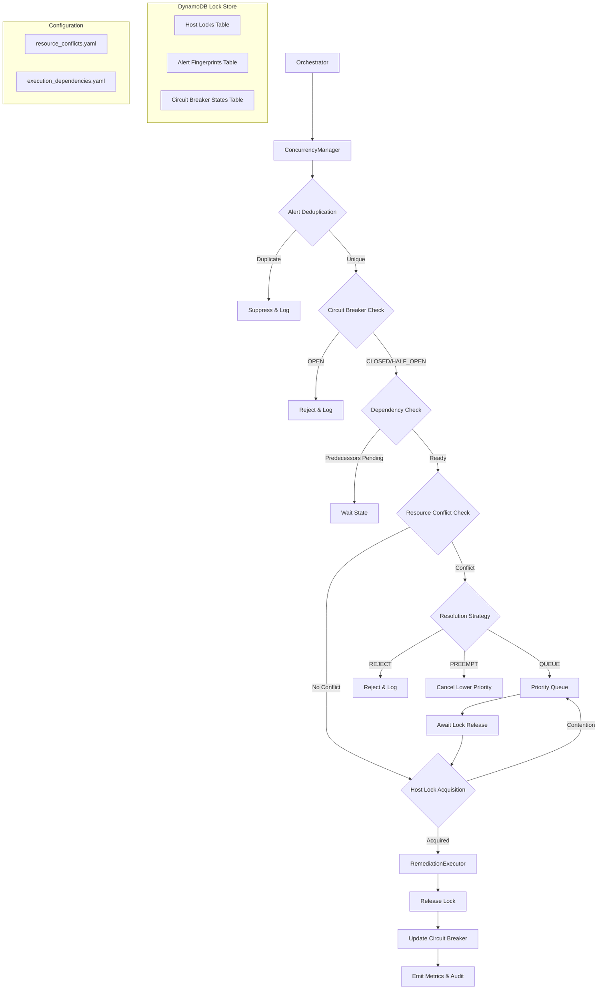

# Design Document: Concurrent Execution Safety

## Overview

This design introduces a **Concurrency Manager** layer between the existing Orchestrator and RemediationExecutor to enforce safe concurrent execution of remediation actions. The current system uses a basic `asyncio.Semaphore(10)` in the executor and `asyncio.Semaphore(50)` in the orchestrator, but lacks host-level mutual exclusion, resource conflict detection, alert deduplication, priority queuing, circuit breaker protection, and dependency management.

The Concurrency Manager intercepts remediation requests after the Orchestrator's match stage and before the Executor's execute call, applying seven coordinated safety mechanisms:

1. **Host-level mutual exclusion** — DynamoDB-backed distributed locks ensuring one remediation per host
2. **Resource conflict detection** — YAML-driven registry preventing conflicting actions on shared resources
3. **Alert deduplication** — Fingerprint-based suppression within configurable windows
4. **Priority-based queuing** — Severity-ordered (P1–P5) execution with preemption
5. **Circuit breaker** — Per-host failure tracking with CLOSED/OPEN/HALF_OPEN state machine
6. **Dependency management** — DAG-based ordering constraints between actions
7. **Observability** — Structured logging, CloudWatch metrics, and status API

### Design Rationale

- **DynamoDB as Lock Store**: Reuses the existing DynamoDB infrastructure (AiopsIncidentMemory table pattern) for lock storage with conditional writes providing atomic lock acquisition and TTL for automatic cleanup.
- **Async-first**: All components use `async/await` to integrate naturally with the existing asyncio pipeline.
- **Configuration-driven**: Resource conflicts and dependencies are YAML-based for ops-friendly management without code changes.
- **Fail-safe**: Lock Store unavailability causes rejection (not execution), preventing unsafe concurrent runs.

## Architecture



### Integration Point

The `ConcurrencyManager` is injected into the `Orchestrator` and called between the match stage (Stage 3) and the execute stage (Stage 4):

```python
# In Orchestrator._run_pipeline, after playbook match:
execution_decision = await self._concurrency_manager.request_execution(
    incident_id=incident_id,
    target_hosts=[target_host],
    action_name=playbook_match.rule_name,
    severity=alert.severity,
    correlation_group=incident_id,
)
if execution_decision.allowed:
    execution_result = await self._executor.execute(...)
    await self._concurrency_manager.complete_execution(...)
```

## Components and Interfaces

### 1. ConcurrencyManager (Main Facade)

```python
class ConcurrencyManager:
    """Facade coordinating all concurrency safety subsystems."""

    def __init__(
        self,
        lock_store: LockStore,
        resource_registry: ResourceConflictRegistry,
        priority_queue: PriorityQueue,
        circuit_breaker: CircuitBreakerManager,
        dependency_graph: DependencyGraph,
        deduplicator: AlertDeduplicator,
        metrics: ConcurrencyMetrics,
    ) -> None: ...

    async def request_execution(
        self,
        incident_id: str,
        target_hosts: list[str],
        action_name: str,
        severity: Severity,
        correlation_group: str,
    ) -> ExecutionDecision: ...

    async def complete_execution(
        self,
        incident_id: str,
        target_hosts: list[str],
        action_name: str,
        outcome: RemediationStatus,
    ) -> None: ...
```

### 2. LockStore (DynamoDB-backed)

```python
class LockStore:
    """DynamoDB-backed distributed lock store with TTL support."""

    async def acquire_host_lock(
        self, host: str, incident_id: str, ttl_seconds: int
    ) -> LockResult: ...

    async def release_host_lock(self, host: str, incident_id: str) -> bool: ...

    async def acquire_host_locks_atomic(
        self, hosts: list[str], incident_id: str, ttl_seconds: int
    ) -> LockResult: ...

    async def read_fingerprint(self, fingerprint: str) -> Optional[FingerprintRecord]: ...

    async def write_fingerprint_conditional(
        self, fingerprint: str, incident_id: str, ttl_seconds: int
    ) -> bool: ...

    async def delete_fingerprint(self, fingerprint: str) -> None: ...

    async def get_circuit_breaker_state(self, host: str) -> CircuitBreakerState: ...

    async def update_circuit_breaker_state(
        self, host: str, state: CircuitBreakerState
    ) -> None: ...
```

### 3. ResourceConflictRegistry

```python
class ResourceConflictRegistry:
    """YAML-configured registry of action-to-resource mappings."""

    def load_from_yaml(self, path: str) -> None: ...
    def get_resource_categories(self, action_name: str) -> list[str]: ...
    def detect_conflicts(
        self, action_name: str, host: str, active_executions: dict[str, list[str]]
    ) -> list[ResourceConflict]: ...
    def get_resolution_strategy(self, resource_category: str) -> ConflictResolutionStrategy: ...
```

### 4. PriorityQueue

```python
class PriorityQueue:
    """In-memory priority queue with severity + timestamp ordering."""

    def enqueue(self, entry: QueueEntry) -> int: ...  # returns position
    def dequeue_for_host(self, host: str) -> Optional[QueueEntry]: ...
    def get_depth(self, host: str) -> int: ...
    def remove_by_incident(self, incident_id: str, host: str) -> bool: ...
    def expire_stale_entries(self, max_wait_seconds: int) -> list[QueueEntry]: ...
    def contains_incident(self, incident_id: str, host: str) -> bool: ...
```

### 5. CircuitBreakerManager

```python
class CircuitBreakerManager:
    """Per-host circuit breaker with CLOSED/OPEN/HALF_OPEN states."""

    async def check_state(self, host: str) -> CircuitBreakerDecision: ...
    async def record_outcome(self, host: str, success: bool) -> StateTransition: ...
    async def manual_reset(self, host: str) -> ResetResult: ...
```

### 6. AlertDeduplicator

```python
class AlertDeduplicator:
    """Fingerprint-based alert deduplication with suppression windows."""

    def compute_fingerprint(
        self, alert_name: str, target_host: str, severity: str
    ) -> str: ...

    async def check_and_acquire(
        self, fingerprint: str, incident_id: str
    ) -> DeduplicationResult: ...

    async def clear_on_failure(self, fingerprint: str) -> None: ...
```

### 7. DependencyGraph

```python
class DependencyGraph:
    """DAG-based execution dependency management."""

    def load_from_yaml(self, path: str) -> None: ...
    def validate_acyclic(self) -> ValidationResult: ...
    def get_predecessors(self, action_name: str) -> list[str]: ...
    def get_transitive_successors(self, action_name: str) -> list[str]: ...
    def are_independent(self, action_a: str, action_b: str) -> bool: ...
```

### 8. ConcurrencyMetrics

```python
class ConcurrencyMetrics:
    """CloudWatch metric publishing and structured log emission."""

    async def emit_queued_event(self, event: QueuedEvent) -> None: ...
    async def emit_conflict_event(self, event: ConflictEvent) -> None: ...
    async def emit_suppression_event(self, event: SuppressionEvent) -> None: ...
    async def emit_circuit_breaker_event(self, event: CircuitBreakerEvent) -> None: ...
    async def emit_preemption_event(self, event: PreemptionEvent) -> None: ...
    async def publish_periodic_metrics(self) -> None: ...
```

### 9. Status API Endpoint

```python
@app.get("/concurrency/status")
async def get_concurrency_status() -> ConcurrencyStatusResponse: ...

@app.post("/concurrency/circuit-breaker/{host}/reset")
async def reset_circuit_breaker(host: str) -> ResetResponse: ...
```

## Data Models

### Enums

```python
class ConflictResolutionStrategy(Enum):
    QUEUE = "QUEUE"
    REJECT = "REJECT"
    PREEMPT = "PREEMPT"

class CircuitBreakerStateEnum(Enum):
    CLOSED = "CLOSED"
    OPEN = "OPEN"
    HALF_OPEN = "HALF_OPEN"

class ExecutionDecisionType(Enum):
    ALLOWED = "ALLOWED"
    QUEUED = "QUEUED"
    REJECTED = "REJECTED"
    SUPPRESSED = "SUPPRESSED"
```

### Core Data Classes

```python
@dataclass
class HostLock:
    host: str
    incident_id: str
    acquired_at: datetime
    ttl_seconds: int
    action_name: str

@dataclass
class QueueEntry:
    incident_id: str
    target_host: str
    action_name: str
    severity: Severity  # P1-P5
    enqueued_at: datetime
    correlation_group: str

    def priority_key(self) -> tuple[int, float]:
        """Returns (severity_rank, timestamp) for ordering.
        Lower severity_rank = higher priority (P1=1, P5=5).
        """
        severity_map = {"P1": 1, "P2": 2, "P3": 3, "P4": 4, "P5": 5}
        return (severity_map[self.severity.value], self.enqueued_at.timestamp())

@dataclass
class CircuitBreakerState:
    host: str
    state: CircuitBreakerStateEnum
    consecutive_failures: int
    last_failure_at: Optional[datetime]
    last_success_at: Optional[datetime]
    failed_incident_ids: list[str]  # up to last 5
    last_failed_action: Optional[str]

@dataclass
class FingerprintRecord:
    fingerprint: str
    incident_id: str
    created_at: datetime
    ttl_seconds: int

@dataclass
class ResourceConflict:
    conflicting_categories: list[str]
    blocking_incident_id: str
    blocking_action_name: str
    resolution_strategy: ConflictResolutionStrategy
    estimated_remaining_seconds: Optional[float]

@dataclass
class ExecutionDecision:
    decision_type: ExecutionDecisionType
    allowed: bool
    reason: Optional[str]
    queue_position: Optional[int]
    blocking_incident_id: Optional[str]

@dataclass
class StateTransition:
    host: str
    previous_state: CircuitBreakerStateEnum
    new_state: CircuitBreakerStateEnum
    trigger: str  # "failure", "cooldown_elapsed", "test_success", "test_failure", "manual_reset"

@dataclass
class PreemptionRecord:
    preempted_incident_id: str
    preempting_incident_id: str
    preempted_severity: Severity
    preempting_severity: Severity
    target_host: str
    timestamp: datetime
    progress_at_preemption: Optional[str]  # "step 3 of 7"
```

### DynamoDB Table Schema

**Table: AiopsExecutionLocks**

| Attribute | Type | Description |
|-----------|------|-------------|
| PK | S | `HOST#<hostname>` or `FINGERPRINT#<hash>` or `CB#<hostname>` |
| SK | S | `LOCK` or `STATE` or `RECORD` |
| incident_id | S | Holding incident ID |
| acquired_at | N | Unix timestamp |
| ttl | N | DynamoDB TTL epoch seconds |
| state | S | Circuit breaker state (for CB records) |
| consecutive_failures | N | Failure count (for CB records) |
| data | M | JSON map with additional attributes |

### YAML Configuration Schemas

**resource_conflicts.yaml:**
```yaml
actions:
  restart_nginx:
    resources:
      - "service:nginx"
      - "network:port-80"
      - "network:port-443"
    strategies:
      "service:nginx": QUEUE
      "network:port-80": REJECT

  scale_up_instances:
    resources:
      - "compute:autoscaling"
      - "memory:system"
    strategies:
      "compute:autoscaling": PREEMPT
      "memory:system": QUEUE

  drain_connections:
    resources:
      - "network:port-80"
      - "network:port-443"
      - "service:nginx"
    strategies:
      "network:port-80": REJECT
```

**execution_dependencies.yaml:**
```yaml
dependencies:
  - predecessor: stop_service
    successor: clear_cache
  - predecessor: clear_cache
    successor: restart_service
  - predecessor: backup_config
    successor: deploy_config

max_nodes: 200
max_edges: 500
```

