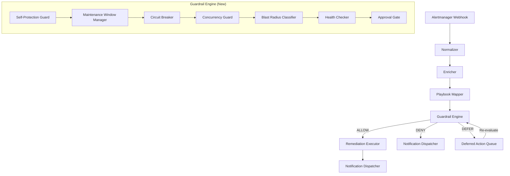
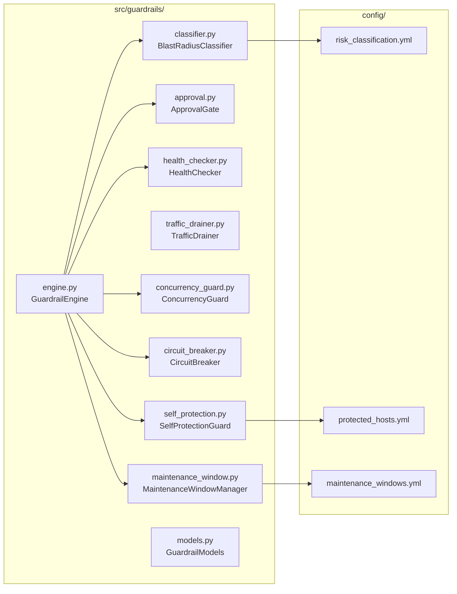
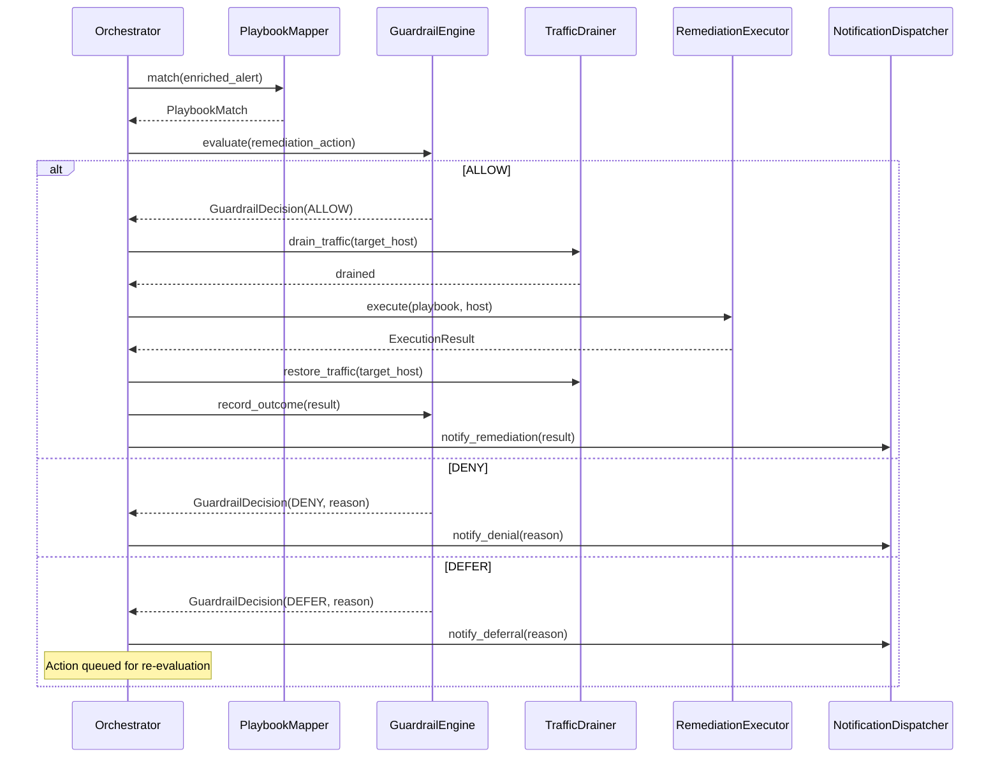
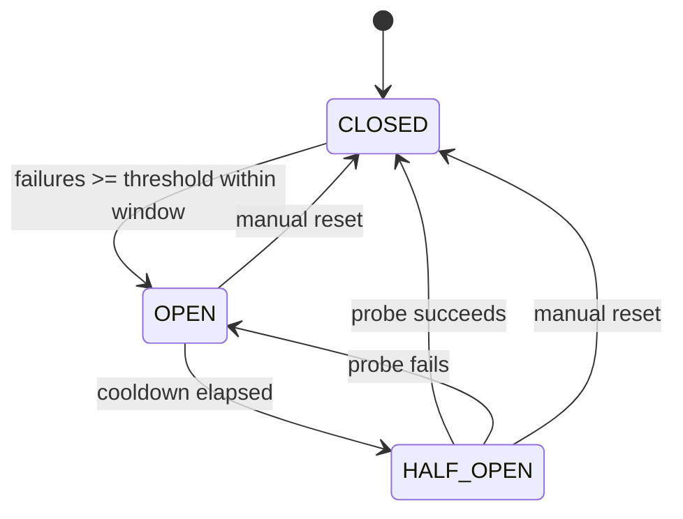
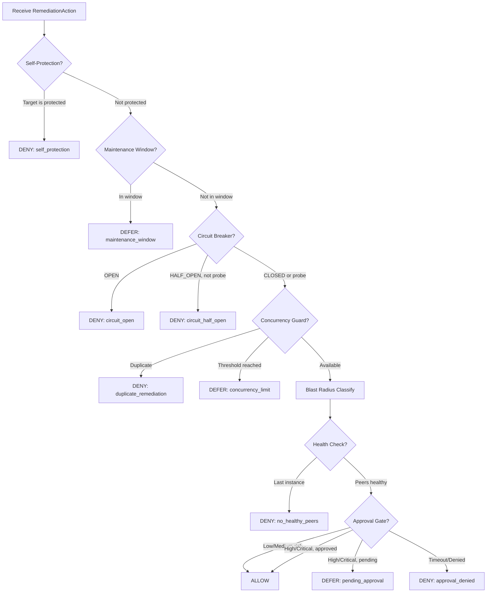

# Design Document: Safe Execution Guardrails

## Overview

The Safe Execution Guardrails feature introduces a multi-layered safety engine between the playbook matching stage and the execution stage of the AIOps self-healing pipeline. The engine evaluates each remediation action through seven ordered checks—Self-Protection, Maintenance Window, Circuit Breaker, Concurrency Guard, Blast Radius Classification, Health Check, and Approval Gate—producing a deterministic ALLOW, DENY, or DEFER decision with full audit trail.

The guardrail engine is implemented as a new `GuardrailEngine` class injected into the `Orchestrator` pipeline. It receives a `PlaybookMatch` and `EnrichedAlert`, evaluates all safety checks in sequence with short-circuit semantics, and returns a `GuardrailDecision` that determines whether execution proceeds.

### Design Goals

- **Fail-safe**: Any ambiguity or error defaults to DENY
- **Deterministic**: Same inputs always produce same decision given same state
- **Auditable**: Every decision is logged with full context
- **Non-invasive**: Existing pipeline stages remain unmodified
- **Configurable**: All thresholds and policies are YAML-driven with hot-reload

## Architecture

### High-Level Architecture Diagram



### Component Architecture



### Pipeline Integration

The `GuardrailEngine` is inserted into the `Orchestrator._run_pipeline()` method between Stage 3 (Match) and Stage 4 (Execute). The existing stages remain unmodified.



## Components and Interfaces

### 1. GuardrailEngine (`src/guardrails/engine.py`)

The central orchestrator of all guardrail checks. Evaluates checks in fixed order with short-circuit semantics.

```python
class GuardrailEngine:
    """Evaluates all safety checks in defined order with short-circuit semantics."""

    EVALUATION_TIMEOUT = 15  # seconds

    def __init__(
        self,
        self_protection: SelfProtectionGuard,
        maintenance_window: MaintenanceWindowManager,
        circuit_breaker: CircuitBreaker,
        concurrency_guard: ConcurrencyGuard,
        classifier: BlastRadiusClassifier,
        health_checker: HealthChecker,
        approval_gate: ApprovalGate,
        notification_dispatcher: NotificationDispatcher,
        audit_logger: AuditLogger,
    ) -> None: ...

    async def evaluate(self, action: RemediationAction) -> GuardrailDecision:
        """Evaluate all guardrail checks for a remediation action.
        
        Returns ALLOW, DENY, or DEFER with full audit trail.
        Completes within 15 seconds or returns DENY with guardrail_timeout.
        """
        ...

    async def record_outcome(self, action: RemediationAction, result: ExecutionResult) -> None:
        """Record execution outcome for circuit breaker and concurrency tracking."""
        ...

    async def release_action(self, action: RemediationAction) -> None:
        """Release concurrency slot after execution completes."""
        ...
```

### 2. BlastRadiusClassifier (`src/guardrails/classifier.py`)

Assigns risk levels based on configurable rules.

```python
class BlastRadiusClassifier:
    """Classifies remediation actions by risk level."""

    def __init__(self, config_path: str = "config/risk_classification.yml") -> None: ...

    def classify(self, action: RemediationAction) -> RiskLevel:
        """Assign a RiskLevel to the action based on loaded rules.
        
        Classification logic:
        1. Check single-instance override → critical
        2. Check database + restart/stop override → critical
        3. Match service_name + playbook_type in rules → base level
        4. Apply environment tier elevation for production
        5. Default to high if no rule matches
        """
        ...

    async def reload_config(self) -> bool:
        """Hot-reload configuration. Returns False and retains old config on failure."""
        ...
```

### 3. ApprovalGate (`src/guardrails/approval.py`)

Manages human approval workflow for high/critical risk actions.

```python
class ApprovalGate:
    """Requests and awaits human approval for high-risk actions."""

    DEFAULT_TIMEOUT = 300  # seconds
    MIN_TIMEOUT = 30
    MAX_TIMEOUT = 1800
    MAX_DELIVERY_RETRIES = 2
    DELIVERY_TIMEOUT = 10  # seconds

    def __init__(
        self,
        notification_dispatcher: NotificationDispatcher,
        timeout: int = DEFAULT_TIMEOUT,
    ) -> None: ...

    async def check(self, action: RemediationAction) -> CheckResult:
        """Request approval if risk is high/critical. Skip for low/medium.
        
        Returns ALLOW for low/medium risk.
        Returns PENDING_APPROVAL (mapped to DEFER) for high/critical.
        Returns DENY on delivery failure or timeout.
        """
        ...

    async def resolve(self, incident_id: str, approved: bool, responder: str) -> None:
        """Resolve a pending approval request."""
        ...
```

### 4. HealthChecker (`src/guardrails/health_checker.py`)

Verifies peer health before destructive actions.

```python
class HealthChecker:
    """Verifies target host has healthy peers before allowing destructive actions."""

    PEER_HEALTH_TIMEOUT = 5  # seconds per peer
    OVERALL_TIMEOUT = 10  # seconds for all checks

    def __init__(self, service_registry: ServiceRegistry) -> None: ...

    async def check(self, action: RemediationAction) -> CheckResult:
        """Verify peer health for the target's service group.
        
        - Single instance (no peers): DENY for critical/high
        - All peers unhealthy: DENY + escalation
        - <2 healthy peers: DENY for critical, ALLOW with warning for others
        - Timeout: DENY for high/critical, ALLOW with warning for others
        """
        ...
```

### 5. TrafficDrainer (`src/guardrails/traffic_drainer.py`)

Manages load balancer traffic draining around execution.

```python
class TrafficDrainer:
    """Removes instance from LB before execution, re-registers after."""

    DEFAULT_DRAIN_PERIOD = 30  # seconds
    MIN_DRAIN_PERIOD = 5
    MAX_DRAIN_PERIOD = 300
    LB_REMOVAL_TIMEOUT = 30  # seconds
    RE_REGISTRATION_TIMEOUT = 60  # seconds
    HEALTH_CHECK_TIMEOUT = 60  # seconds
    MAX_RE_REGISTRATION_RETRIES = 3

    def __init__(self, lb_client: LoadBalancerClient) -> None: ...

    async def drain(self, target_host: str, service_group: str) -> DrainResult:
        """Remove instance from LB and wait for drain period."""
        ...

    async def restore(self, target_host: str, service_group: str) -> RestoreResult:
        """Health-check and re-register instance with LB."""
        ...
```

### 6. ConcurrencyGuard (`src/guardrails/concurrency_guard.py`)

Prevents duplicate remediations and enforces rolling restart limits.

```python
class ConcurrencyGuard:
    """Prevents duplicate remediations and limits concurrent restarts."""

    DEFAULT_ROLLING_RESTART_PCT = 25
    MIN_ROLLING_RESTART_PCT = 5
    MAX_ROLLING_RESTART_PCT = 50
    DEFAULT_MAX_DEFER_DURATION = 600  # seconds
    SLOT_RELEASE_TIMEOUT = 5  # seconds

    def __init__(
        self,
        lock_store: LockStore,
        service_registry: ServiceRegistry,
        executor_timeout: int = 300,
    ) -> None: ...

    async def check(self, action: RemediationAction) -> CheckResult:
        """Check for duplicates and rolling restart threshold.
        
        - Existing lock on host: DENY with "duplicate_remediation"
        - Threshold reached: DEFER
        - Lock store unavailable: DENY with "lock_store_unavailable"
        """
        ...

    async def acquire(self, action: RemediationAction) -> bool:
        """Acquire concurrency slot. Called after ALLOW decision."""
        ...

    async def release(self, action: RemediationAction) -> None:
        """Release concurrency slot after execution completes."""
        ...
```

### 7. CircuitBreaker (`src/guardrails/circuit_breaker.py`)

Halts automation when failure rate exceeds threshold.

```python
class CircuitBreakerState(Enum):
    CLOSED = "closed"
    OPEN = "open"
    HALF_OPEN = "half_open"

class CircuitBreaker:
    """Tracks failure rates and halts automation on systemic issues."""

    DEFAULT_FAILURE_THRESHOLD = 3
    DEFAULT_TIME_WINDOW = 300  # seconds
    DEFAULT_COOLDOWN = 300  # seconds

    def __init__(
        self,
        failure_threshold: int = DEFAULT_FAILURE_THRESHOLD,
        time_window: int = DEFAULT_TIME_WINDOW,
        cooldown: int = DEFAULT_COOLDOWN,
    ) -> None: ...

    async def check(self, action: RemediationAction) -> CheckResult:
        """Check circuit breaker state.
        
        - OPEN: DENY all
        - HALF_OPEN: ALLOW exactly one probe
        - CLOSED: ALLOW
        """
        ...

    def record_failure(self, incident_id: str) -> None:
        """Record a remediation failure. May trigger OPEN transition."""
        ...

    def record_success(self) -> None:
        """Record a remediation success. May close circuit in HALF_OPEN."""
        ...

    def manual_reset(self) -> None:
        """Manually reset to CLOSED state."""
        ...

    @property
    def state(self) -> CircuitBreakerState: ...
```

### 8. SelfProtectionGuard (`src/guardrails/self_protection.py`)

Blocks actions targeting the automation host or its dependencies.

```python
class SelfProtectionGuard:
    """Detects and blocks actions targeting the automation system itself."""

    MAX_PROTECTED_HOSTS = 50

    def __init__(self, config_path: str = "config/protected_hosts.yml") -> None: ...

    async def check(self, action: RemediationAction) -> CheckResult:
        """Check if target host is in the protected list.
        
        Matching is case-insensitive against both hostname and FQDN.
        Returns DENY with "self_protection" if matched.
        """
        ...

    async def reload_config(self) -> bool:
        """Hot-reload protected hosts. Retains old config on failure."""
        ...
```

### 9. MaintenanceWindowManager (`src/guardrails/maintenance_window.py`)

Defers actions during maintenance windows or deployments.

```python
class MaintenanceWindowManager:
    """Checks maintenance window schedules and defers actions accordingly."""

    MAX_WINDOWS = 100
    RELOAD_INTERVAL = 60  # seconds
    MAX_DEFER_AGE = 3600  # 60 minutes

    def __init__(self, config_path: str = "config/maintenance_windows.yml") -> None: ...

    async def check(self, action: RemediationAction) -> CheckResult:
        """Check if current time falls within a maintenance window.
        
        - Global window active: DEFER all actions
        - Service-group window active: DEFER only matching actions
        - Unknown service group: DEFER conservatively
        - No window active: ALLOW
        """
        ...

    def is_in_window(self, service_group: Optional[str], timestamp: datetime) -> bool:
        """Determine if a timestamp falls within any active window."""
        ...

    async def reload_config(self) -> bool:
        """Periodic reload of maintenance window config."""
        ...
```

### 10. Supporting Interfaces

```python
class LockStore(Protocol):
    """Abstract lock store for concurrency management."""

    async def acquire(self, key: str, ttl: int) -> bool: ...
    async def release(self, key: str) -> bool: ...
    async def is_held(self, key: str) -> bool: ...
    async def count_held(self, prefix: str) -> int: ...

class ServiceRegistry(Protocol):
    """Provides service group membership and health endpoints."""

    def get_service_group(self, hostname: str) -> Optional[ServiceGroup]: ...
    def get_peers(self, hostname: str, service_group: str) -> list[str]: ...
    def get_health_endpoint(self, hostname: str) -> str: ...

class LoadBalancerClient(Protocol):
    """Abstract load balancer operations."""

    async def deregister(self, instance_id: str, target_group: str) -> bool: ...
    async def register(self, instance_id: str, target_group: str) -> bool: ...
    async def is_registered(self, instance_id: str, target_group: str) -> bool: ...
```

## Data Models

### Core Guardrail Models (`src/guardrails/models.py`)

```python
from dataclasses import dataclass, field
from datetime import datetime
from enum import Enum
from typing import Optional


class RiskLevel(Enum):
    """Risk classification levels for remediation actions."""
    LOW = "low"
    MEDIUM = "medium"
    HIGH = "high"
    CRITICAL = "critical"

    def elevate(self) -> "RiskLevel":
        """Return the next higher risk level (capped at CRITICAL)."""
        order = [RiskLevel.LOW, RiskLevel.MEDIUM, RiskLevel.HIGH, RiskLevel.CRITICAL]
        idx = order.index(self)
        return order[min(idx + 1, len(order) - 1)]


class GuardrailDecisionType(Enum):
    """Possible guardrail decisions."""
    ALLOW = "allow"
    DENY = "deny"
    DEFER = "defer"
    PENDING_APPROVAL = "pending_approval"


class CheckResultType(Enum):
    """Result of an individual guardrail check."""
    ALLOW = "allow"
    DENY = "deny"
    DEFER = "defer"


@dataclass
class CheckResult:
    """Result from a single guardrail check."""
    result: CheckResultType
    check_name: str
    reason: str = ""  # max 512 characters


@dataclass
class RemediationAction:
    """A remediation action to be evaluated by the guardrail engine."""
    incident_id: str
    alert_name: str
    playbook_path: str
    playbook_type: str  # e.g., "restart", "stop", "scale", "log-rotate"
    target_host: str
    service_name: str
    service_group: Optional[str] = None
    environment_tier: str = "production"  # production, staging, development
    risk_level: Optional[RiskLevel] = None
    severity: str = "P2"
    labels: dict[str, str] = field(default_factory=dict)


@dataclass
class GuardrailDecision:
    """Final decision from the guardrail engine."""
    decision: GuardrailDecisionType
    check_name: str  # The check that produced the terminal decision
    reason: str  # max 512 characters
    incident_id: str
    timestamp: datetime = field(default_factory=lambda: datetime.now())
    checks_evaluated: list[CheckResult] = field(default_factory=list)
    risk_level: Optional[RiskLevel] = None


@dataclass
class DeferredAction:
    """An action that has been deferred for later re-evaluation."""
    action: RemediationAction
    decision: GuardrailDecision
    deferred_at: datetime
    defer_reason: str
    max_defer_duration: int = 600  # seconds
    re_evaluate_after: Optional[datetime] = None
```

### Configuration Schemas

#### `config/risk_classification.yml`

```yaml
# Risk classification rules
environment_elevation:
  production: true  # Elevate risk by one level in production

single_instance_services:
  - postgres-primary
  - redis-cache

database_services:
  - postgres-primary
  - mysql-primary
  - mongodb-primary

rules:
  - service_name: web-frontend
    playbook_type: restart
    base_risk: low
  - service_name: web-frontend
    playbook_type: stop
    base_risk: medium
  - service_name: api-gateway
    playbook_type: restart
    base_risk: medium
  - service_name: api-gateway
    playbook_type: stop
    base_risk: high
  - service_name: "*"
    playbook_type: log-rotate
    base_risk: low
  - service_name: "*"
    playbook_type: scale
    base_risk: low

defaults:
  unknown_service_risk: high
  unknown_playbook_risk: high
  missing_config_risk: high
```

#### `config/protected_hosts.yml`

```yaml
# Protected hosts that cannot be targeted by automation
protected_hosts:
  - hostname: aiops-controller-01.prod.example.com
    fqdn: aiops-controller-01.prod.example.com
    reason: "Automation host - self-protection"
  - hostname: audit-db-01.prod.example.com
    fqdn: audit-db-01.prod.example.com
    reason: "Audit log database - critical dependency"
  - hostname: notification-svc-01.prod.example.com
    fqdn: notification-svc-01.prod.example.com
    reason: "Notification service - critical dependency"
```

#### `config/maintenance_windows.yml`

```yaml
# Maintenance window schedules
windows:
  - name: weekly-deployment-window
    type: recurring
    schedule: weekly
    day_of_week: wednesday
    start_time: "02:00"
    end_time: "04:00"
    timezone: UTC
    scope: global

  - name: database-maintenance
    type: recurring
    schedule: monthly
    day_of_month: 1
    start_time: "03:00"
    end_time: "05:00"
    timezone: UTC
    scope: service_group
    service_groups:
      - postgres-primary
      - mysql-primary

  - name: q4-release-freeze
    type: one_time
    start: "2024-12-20T00:00:00Z"
    end: "2025-01-02T00:00:00Z"
    scope: global
```

### Environment Variables (additions to `src/config.py`)

```python
# Guardrail configuration environment variables
GUARDRAIL_ENV_VARS = {
    "RISK_CLASSIFICATION_PATH": "config/risk_classification.yml",
    "PROTECTED_HOSTS_PATH": "config/protected_hosts.yml",
    "MAINTENANCE_WINDOWS_PATH": "config/maintenance_windows.yml",
    "APPROVAL_TIMEOUT": "300",
    "CIRCUIT_BREAKER_THRESHOLD": "3",
    "CIRCUIT_BREAKER_WINDOW": "300",
    "CIRCUIT_BREAKER_COOLDOWN": "300",
    "ROLLING_RESTART_PERCENTAGE": "25",
    "MAX_DEFER_DURATION": "600",
    "DRAIN_PERIOD": "30",
    "ENVIRONMENT_TIER": "production",
}
```

### Circuit Breaker State Machine



### Guardrail Evaluation Flow



## Correctness Properties

*A property is a characteristic or behavior that should hold true across all valid executions of a system—essentially, a formal statement about what the system should do. Properties serve as the bridge between human-readable specifications and machine-verifiable correctness guarantees.*

### Property 1: Classification always produces exactly one valid RiskLevel

*For any* valid combination of (service_name, playbook_type, environment_tier), the BlastRadiusClassifier SHALL return exactly one RiskLevel from {LOW, MEDIUM, HIGH, CRITICAL}, never None and never multiple values.

**Validates: Requirements 1.1**

### Property 2: Single-instance services always classify as critical

*For any* remediation action targeting a service configured as single-instance, the BlastRadiusClassifier SHALL return CRITICAL regardless of playbook_type or environment_tier.

**Validates: Requirements 1.4**

### Property 3: Database restart/stop always classifies as critical

*For any* remediation action with playbook_type in {restart, stop} targeting a service configured as a database service, the BlastRadiusClassifier SHALL return CRITICAL regardless of environment_tier.

**Validates: Requirements 1.5**

### Property 4: Production environment elevates risk by exactly one level

*For any* remediation action, the risk level assigned in production SHALL be exactly one level higher than the risk level assigned for the same (service_name, playbook_type) in a non-production environment, capped at CRITICAL.

**Validates: Requirements 1.7**

### Property 5: Unknown service or playbook defaults to high

*For any* service_name or playbook_type not present in the loaded risk classification rules, the BlastRadiusClassifier SHALL return HIGH as the base risk level (before environment elevation).

**Validates: Requirements 1.6**

### Property 6: Missing config defaults all classifications to high

*For any* remediation action evaluated when the risk classification config file is missing or unparseable, the BlastRadiusClassifier SHALL return HIGH.

**Validates: Requirements 1.3**

### Property 7: Hot-reload retains valid config on invalid file

*For any* guardrail component with hot-reload capability (BlastRadiusClassifier, SelfProtectionGuard, MaintenanceWindowManager), if a valid configuration is loaded and a subsequent reload encounters an invalid file, the component SHALL retain the previously loaded valid configuration unchanged.

**Validates: Requirements 1.2, 7.8, 8.3**

### Property 8: Approval gate skipped for low/medium risk

*For any* remediation action with RiskLevel of LOW or MEDIUM, the ApprovalGate SHALL not be invoked and the action SHALL proceed without human approval.

**Validates: Requirements 2.7**

### Property 9: Approval timeout validation clamps to defaults

*For any* configured approval timeout value that is below 30, above 1800, or not a valid integer, the ApprovalGate SHALL use the default value of 300 seconds.

**Validates: Requirements 2.6**

### Property 10: Duplicate remediation always denied

*For any* remediation action targeting a host that already has an active (non-expired, non-released) concurrency slot, the ConcurrencyGuard SHALL return DENY with reason "duplicate_remediation".

**Validates: Requirements 5.1**

### Property 11: Rolling restart threshold enforces concurrency limit

*For any* service group where the number of active concurrency slots equals or exceeds max(floor(group_size × rolling_restart_percentage / 100), 1), the ConcurrencyGuard SHALL return DEFER for new actions targeting that service group.

**Validates: Requirements 5.2, 5.4**

### Property 12: Lock auto-expiry after timeout plus buffer

*For any* concurrency slot acquired by the ConcurrencyGuard, the slot SHALL automatically expire after (executor_timeout + 60) seconds if not explicitly released.

**Validates: Requirements 5.6**

### Property 13: Circuit breaker opens on threshold breach

*For any* sequence of remediation failures where the count of failures within the configured sliding time window exceeds the configured failure threshold, the CircuitBreaker SHALL transition to OPEN state.

**Validates: Requirements 6.1**

### Property 14: Open circuit breaker denies all actions

*For any* new remediation action submitted while the CircuitBreaker is in OPEN state, the CircuitBreaker SHALL return DENY regardless of the action's RiskLevel or other attributes.

**Validates: Requirements 6.2**

### Property 15: Circuit breaker config validation clamps to defaults

*For any* circuit breaker configuration value (failure_threshold, time_window, cooldown) that is outside its valid range or not a valid integer, the CircuitBreaker SHALL use the default value for that parameter.

**Validates: Requirements 6.4, 6.8**

### Property 16: Self-protection denies with case-insensitive matching

*For any* remediation action targeting a host whose hostname or FQDN matches (case-insensitively) any entry in the protected hosts list, the SelfProtectionGuard SHALL return DENY with reason "self_protection".

**Validates: Requirements 7.1, 7.2**

### Property 17: Maintenance window defers actions for matching scope

*For any* remediation action evaluated when the current timestamp falls within an active maintenance window, the MaintenanceWindowManager SHALL return DEFER if the window scope is global OR if the window's service_group matches the action's service_group.

**Validates: Requirements 8.1, 8.5, 8.6**

### Property 18: Recurring schedule detection

*For any* timestamp and recurring maintenance window schedule (daily, weekly, or monthly), the MaintenanceWindowManager SHALL correctly determine whether the timestamp falls within the window's active period.

**Validates: Requirements 8.4**

### Property 19: Evaluation short-circuits on non-ALLOW result

*For any* remediation action where a guardrail check returns DENY or DEFER, the GuardrailEngine SHALL stop evaluation immediately and not invoke any subsequent checks in the evaluation order.

**Validates: Requirements 9.2, 9.3**

### Property 20: Evaluation order is fixed and deterministic

*For any* remediation action that passes all checks (all return ALLOW), the GuardrailEngine SHALL have evaluated checks in exactly this order: SelfProtectionGuard, MaintenanceWindowManager, CircuitBreaker, ConcurrencyGuard, BlastRadiusClassifier, HealthChecker, ApprovalGate.

**Validates: Requirements 9.1, 9.9**

### Property 21: Every evaluation produces a structured audit log

*For any* remediation action evaluated by the GuardrailEngine, a structured JSON log entry SHALL be produced containing: incident_id, decision (ALLOW/DENY/DEFER), check_name, reason (≤512 chars), and timestamp.

**Validates: Requirements 9.4**

### Property 22: Internal check errors result in DENY

*For any* guardrail check that raises an unhandled exception or encounters an internal error, the GuardrailEngine SHALL treat it as DENY with a reason indicating the check name and failure type.

**Validates: Requirements 9.8**

### Property 23: Health check peer verification for multi-instance groups

*For any* remediation action targeting a host in a service group with 2+ instances, the HealthChecker SHALL query the health of all peer instances (excluding the target) before returning a decision.

**Validates: Requirements 3.1**

### Property 24: Health check risk-based decision for low peer availability

*For any* remediation action where fewer than 2 healthy peers remain in the service group, the HealthChecker SHALL return DENY for CRITICAL risk level and ALLOW (with warning) for HIGH, MEDIUM, and LOW risk levels.

**Validates: Requirements 3.3**

## Error Handling

### Error Handling Strategy

The guardrail engine follows a **fail-safe** philosophy: any error or ambiguity defaults to DENY.

| Error Condition | Behavior | Requirement |
|---|---|---|
| Config file missing at startup | Default to high risk / refuse to start (component-specific) | 1.3, 7.4, 7.5, 8.3 |
| Config file invalid during reload | Retain previous valid config, log error | 1.2, 7.8, 8.3 |
| Health check timeout | DENY for high/critical, ALLOW with warning for low/medium | 3.4 |
| Lock store unavailable | DENY with "lock_store_unavailable" | 5.7 |
| Approval delivery failure | Retry 2x with backoff, then DENY | 2.8 |
| LB removal failure | Verify absence from target list, DENY if still present | 4.5 |
| LB re-registration failure | Retry 3x with backoff, log error, include in result | 4.8 |
| Circuit breaker in OPEN state | DENY all new actions | 6.2 |
| Guardrail evaluation timeout (>15s) | DENY with "guardrail_timeout" | 9.6 |
| Any check raises exception | DENY with check name and error type | 9.8 |
| Deferred action exceeds max age | Discard as stale, mark expired | 8.8 |

### Exception Handling Pattern

Each guardrail check is wrapped in a try/except within the engine:

```python
async def _run_check(self, check: GuardrailCheck, action: RemediationAction) -> CheckResult:
    """Run a single guardrail check with error isolation."""
    try:
        return await asyncio.wait_for(
            check.check(action),
            timeout=self.EVALUATION_TIMEOUT
        )
    except asyncio.TimeoutError:
        return CheckResult(
            result=CheckResultType.DENY,
            check_name=check.name,
            reason=f"Check '{check.name}' timed out"
        )
    except Exception as e:
        logger.error(f"Check '{check.name}' failed with error: {e}")
        return CheckResult(
            result=CheckResultType.DENY,
            check_name=check.name,
            reason=f"Check '{check.name}' internal error: {type(e).__name__}"
        )
```

### Startup Validation

Components with strict startup requirements:

| Component | Missing Config | Invalid Config | Empty Config |
|---|---|---|---|
| BlastRadiusClassifier | Default to high, log warning | Default to high, log warning | Default to high, log warning |
| SelfProtectionGuard | Use local hostname | Refuse to start | Refuse to start |
| MaintenanceWindowManager | Refuse to start | Refuse to start | Allow (no windows) |

### Retry Policies

| Operation | Max Retries | Backoff Strategy | Initial Delay |
|---|---|---|---|
| Approval notification delivery | 2 | Exponential | 2 seconds |
| LB re-registration | 3 | Exponential | 2 seconds |
| Deferred action re-evaluation | Unlimited (until max defer) | Fixed | 30 seconds |

## Testing Strategy

### Property-Based Testing

This feature is well-suited for property-based testing because:
- The classification logic is a pure function with a large input space (service × playbook × environment)
- The circuit breaker state machine has universal invariants
- The concurrency guard has threshold-based properties that hold across all inputs
- The evaluation engine has deterministic ordering properties

**Library**: [Hypothesis](https://hypothesis.readthedocs.io/) (Python PBT library)

**Configuration**: Minimum 100 iterations per property test.

**Tag format**: `# Feature: safe-execution-guardrails, Property {N}: {property_text}`

### Test Categories

#### Property-Based Tests (Hypothesis)

| Property | Component | What It Tests |
|---|---|---|
| P1: Classification totality | BlastRadiusClassifier | Always returns exactly one RiskLevel |
| P2: Single-instance → critical | BlastRadiusClassifier | Override rule for single-instance services |
| P3: Database restart/stop → critical | BlastRadiusClassifier | Override rule for database services |
| P4: Production elevation | BlastRadiusClassifier | Metamorphic: prod = non-prod + 1 level |
| P5: Unknown defaults to high | BlastRadiusClassifier | Default behavior for unmatched rules |
| P6: Missing config → high | BlastRadiusClassifier | Fallback on missing configuration |
| P7: Hot-reload retains valid | All configurable components | Config resilience |
| P8: Low/medium skips approval | ApprovalGate | Conditional invocation |
| P9: Timeout clamping | ApprovalGate | Config validation bounds |
| P10: Duplicate → DENY | ConcurrencyGuard | Lock-based deduplication |
| P11: Threshold → DEFER | ConcurrencyGuard | Rolling restart enforcement |
| P12: Lock auto-expiry | ConcurrencyGuard | TTL-based cleanup |
| P13: Threshold breach → OPEN | CircuitBreaker | State transition trigger |
| P14: OPEN → DENY all | CircuitBreaker | State-based blocking |
| P15: Config clamping | CircuitBreaker | Bounds validation |
| P16: Case-insensitive self-protection | SelfProtectionGuard | Matching semantics |
| P17: Window scope matching | MaintenanceWindowManager | Scope-based deferral |
| P18: Recurring schedule detection | MaintenanceWindowManager | Time-based logic |
| P19: Short-circuit on non-ALLOW | GuardrailEngine | Evaluation semantics |
| P20: Fixed evaluation order | GuardrailEngine | Deterministic ordering |
| P21: Audit log completeness | GuardrailEngine | Logging invariant |
| P22: Exception → DENY | GuardrailEngine | Error isolation |
| P23: Peer health verification | HealthChecker | Coverage of all peers |
| P24: Risk-based health decision | HealthChecker | Conditional logic |

#### Unit Tests (pytest)

- Specific approval flow scenarios (approve, deny, timeout)
- Circuit breaker state transitions (CLOSED→OPEN→HALF_OPEN→CLOSED)
- Manual circuit breaker reset
- Traffic drainer drain/restore sequences
- LB removal failure scenarios
- Deferred action expiry after 60 minutes
- Startup validation failures (empty protected hosts, missing maintenance config)
- Notification delivery retry with backoff

#### Integration Tests

- Full pipeline integration: match → guardrail → execute flow
- Config file hot-reload with file system watcher
- HTTP health check against mock servers
- Load balancer client mock interactions
- Orchestrator pipeline with guardrail engine injected

### Test File Structure

```
tests/
├── guardrails/
│   ├── test_classifier_properties.py      # PBT for BlastRadiusClassifier
│   ├── test_circuit_breaker_properties.py # PBT for CircuitBreaker
│   ├── test_concurrency_properties.py     # PBT for ConcurrencyGuard
│   ├── test_engine_properties.py          # PBT for GuardrailEngine
│   ├── test_self_protection_properties.py # PBT for SelfProtectionGuard
│   ├── test_maintenance_properties.py     # PBT for MaintenanceWindowManager
│   ├── test_health_checker_properties.py  # PBT for HealthChecker
│   ├── test_approval_gate.py             # Unit tests for ApprovalGate
│   ├── test_traffic_drainer.py           # Unit tests for TrafficDrainer
│   ├── test_circuit_breaker.py           # Unit tests for state transitions
│   └── test_pipeline_integration.py      # Integration tests
```
