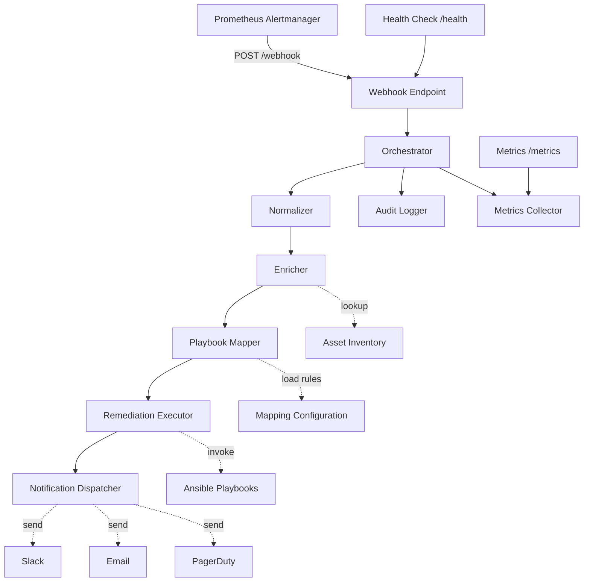
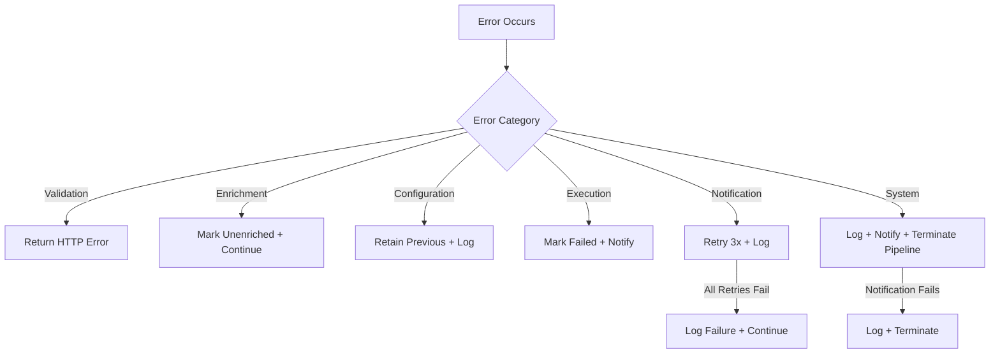

# Design Document: Self-Healing Infrastructure

## Overview

This system implements an automated self-healing infrastructure pipeline that receives Prometheus Alertmanager webhooks, processes alerts through a multi-stage pipeline (normalization → enrichment → playbook matching → execution → notification), and provides full audit logging and metrics. The system is built in Python, packaged as a Docker container, and uses Ansible for remediation execution.

The architecture follows a pipeline pattern where each stage is a discrete, testable component connected by the Orchestrator. This design enables independent testing, clear separation of concerns, and straightforward extension of individual stages.

## Architecture



### Key Architectural Decisions

1. **Async Pipeline with Sync Stages**: The webhook endpoint accepts alerts asynchronously (using Python asyncio/FastAPI), but each pipeline stage executes synchronously within a pipeline run. This simplifies error handling and audit logging while maintaining concurrency across independent alerts.

2. **FastAPI as HTTP Framework**: FastAPI provides async support, automatic OpenAPI docs, request validation via Pydantic, and high performance — well-suited for a webhook receiver.

3. **subprocess for Ansible Execution**: Ansible playbooks are invoked via `ansible-playbook` subprocess rather than the Ansible Python API. This provides better isolation, timeout control, and matches how operators typically run playbooks.

4. **File-based Configuration**: Asset inventory and playbook mapping use YAML files loaded at startup with hot-reload support. This keeps the system simple and GitOps-friendly.

5. **Structured JSON Logging**: All logs (audit and operational) are JSON-formatted to stdout/stderr for easy integration with log aggregation systems (ELK, CloudWatch, etc.).

## Components and Interfaces

### 1. Webhook Endpoint (FastAPI Application)

**Responsibility**: HTTP server exposing alert reception and health check endpoints.

```python
class WebhookEndpoint:
    """FastAPI application handling incoming webhooks and health checks."""
    
    async def receive_alert(request: AlertmanagerPayload) -> Response:
        """POST /webhook - Receives Alertmanager payloads."""
        ...
    
    async def health_check() -> HealthResponse:
        """GET /health - Returns service health status."""
        ...
    
    async def metrics() -> str:
        """GET /metrics - Returns Prometheus metrics."""
        ...
```

### 2. Normalizer

**Responsibility**: Parses raw Alertmanager payloads into standardized internal alert objects.

```python
class Normalizer:
    """Transforms raw Alertmanager payloads into normalized alert objects."""
    
    SEVERITY_MAP = {"critical": "P1", "warning": "P2", "info": "P3"}
    
    def normalize(self, payload: AlertmanagerPayload) -> list[NormalizedAlert]:
        """Extracts individual alerts from a grouped payload."""
        ...
```

### 3. Enricher

**Responsibility**: Augments normalized alerts with environment context from the asset inventory.

```python
class Enricher:
    """Enriches alerts with asset inventory data."""
    
    def __init__(self, asset_inventory: AssetInventory):
        self.inventory = asset_inventory
    
    def enrich(self, alert: NormalizedAlert) -> EnrichedAlert:
        """Looks up host in inventory and attaches metadata."""
        ...
```

### 4. Playbook Mapper

**Responsibility**: Matches enriched alerts to Ansible playbooks using configurable rules.

```python
class PlaybookMapper:
    """Maps alerts to remediation playbooks based on configurable rules."""
    
    def __init__(self, mapping_config_path: str):
        self.rules = self._load_rules(mapping_config_path)
    
    def match(self, alert: EnrichedAlert) -> PlaybookMatch | None:
        """Evaluates rules and returns the best matching playbook."""
        ...
    
    def reload(self) -> None:
        """Reloads mapping configuration from disk."""
        ...
```

### 5. Remediation Executor

**Responsibility**: Invokes Ansible playbooks and captures execution results.

```python
class RemediationExecutor:
    """Executes Ansible playbooks against target hosts."""
    
    def __init__(self, timeout: int = 300):
        self.timeout = timeout
    
    async def execute(self, playbook_path: str, target_host: str, 
                      extra_vars: dict) -> ExecutionResult:
        """Runs ansible-playbook subprocess with timeout."""
        ...
```

### 6. Notification Dispatcher

**Responsibility**: Sends notifications to configured channels with retry logic.

```python
class NotificationDispatcher:
    """Dispatches notifications to Slack, email, and PagerDuty."""
    
    def __init__(self, channels: list[NotificationChannel]):
        self.channels = channels
    
    async def notify_incident(self, alert: EnrichedAlert) -> None:
        """Sends incident detection notification."""
        ...
    
    async def notify_remediation(self, result: RemediationResult) -> None:
        """Sends remediation outcome notification."""
        ...
```

### 7. Orchestrator

**Responsibility**: Coordinates the full pipeline and manages concurrency.

```python
class Orchestrator:
    """Coordinates the incident lifecycle pipeline."""
    
    def __init__(self, normalizer, enricher, mapper, executor, 
                 dispatcher, audit_logger, metrics_collector):
        ...
    
    async def process_alert_payload(self, payload: AlertmanagerPayload) -> None:
        """Runs the full pipeline for an incoming payload."""
        ...
```

### 8. Audit Logger

**Responsibility**: Persists structured audit records for all incidents.

```python
class AuditLogger:
    """Records audit trail entries in JSON format."""
    
    def log_incident(self, record: AuditRecord) -> None:
        """Writes an audit record to the log file."""
        ...
```

### 9. Metrics Collector

**Responsibility**: Tracks and exposes operational metrics in Prometheus format.

```python
class MetricsCollector:
    """Collects and exposes Prometheus metrics."""
    
    def increment_alerts_received(self) -> None: ...
    def increment_remediation_success(self) -> None: ...
    def increment_remediation_failure(self) -> None: ...
    def increment_no_playbook_match(self) -> None: ...
    def increment_notification_failure(self) -> None: ...
    
    def render_metrics(self) -> str:
        """Returns metrics in Prometheus exposition format."""
        ...
```

## Data Models

```python
from dataclasses import dataclass, field
from datetime import datetime
from enum import Enum
from typing import Optional
import uuid

class Severity(Enum):
    P1 = "P1"  # critical
    P2 = "P2"  # warning
    P3 = "P3"  # info

class RemediationStatus(Enum):
    SUCCESS = "success"
    FAILURE = "failure"
    TIMEOUT = "timeout"

class AlertStatus(Enum):
    FIRING = "firing"
    RESOLVED = "resolved"

@dataclass
class AlertmanagerAlert:
    """Single alert from Alertmanager payload."""
    status: str
    labels: dict[str, str]
    annotations: dict[str, str]
    starts_at: str
    ends_at: str
    generator_url: str = ""
    fingerprint: str = ""

@dataclass
class AlertmanagerPayload:
    """Full Alertmanager webhook payload."""
    version: str
    group_key: str
    status: str
    receiver: str
    alerts: list[AlertmanagerAlert]
    group_labels: dict[str, str] = field(default_factory=dict)
    common_labels: dict[str, str] = field(default_factory=dict)
    common_annotations: dict[str, str] = field(default_factory=dict)
    external_url: str = ""

@dataclass
class NormalizedAlert:
    """Standardized internal alert representation."""
    incident_id: str
    alert_name: str
    severity: Severity
    status: AlertStatus
    labels: dict[str, str]
    annotations: dict[str, str]
    starts_at: datetime
    ends_at: Optional[datetime]
    raw_fingerprint: str = ""

@dataclass
class AssetInfo:
    """Asset inventory entry."""
    hostname: str
    ip_address: str
    location: str
    service_name: str
    service_owner: str

@dataclass
class EnrichedAlert:
    """Alert enriched with asset context."""
    incident_id: str
    alert_name: str
    severity: Severity
    status: AlertStatus
    labels: dict[str, str]
    annotations: dict[str, str]
    starts_at: datetime
    ends_at: Optional[datetime]
    asset: Optional[AssetInfo] = None
    is_enriched: bool = False

@dataclass
class MappingRule:
    """A single playbook mapping rule."""
    name: str
    conditions: dict[str, str]  # attribute -> expected value
    playbook_path: str
    priority: int = 0

@dataclass
class PlaybookMatch:
    """Result of playbook matching."""
    rule_name: str
    playbook_path: str
    matched_attributes: int

@dataclass
class ExecutionResult:
    """Result of Ansible playbook execution."""
    status: RemediationStatus
    return_code: int
    stdout: str
    stderr: str
    duration_seconds: float
    playbook_path: str
    target_host: str

@dataclass
class AuditRecord:
    """Complete audit trail entry for an incident."""
    incident_id: str
    alert_name: str
    severity: str
    affected_host: str
    timestamp_received: datetime
    enrichment_data: Optional[dict]
    matched_playbook: Optional[str]
    execution_result: Optional[str]
    execution_duration: Optional[float]
    notification_status: str
    output_summary: str = ""

@dataclass
class HealthResponse:
    """Health check response."""
    status: str  # "healthy" or "degraded"
    uptime_seconds: float
    version: str
    dependencies: dict[str, str]  # component -> status
```

## Correctness Properties

*A property is a characteristic or behavior that should hold true across all valid executions of a system — essentially, a formal statement about what the system should do. Properties serve as the bridge between human-readable specifications and machine-verifiable correctness guarantees.*

### Property 1: Valid payload acceptance

*For any* valid AlertmanagerPayload containing at least one alert with non-empty alert name, status, and severity fields, the webhook endpoint SHALL return HTTP 200.

**Validates: Requirements 1.2**

### Property 2: Invalid payload rejection

*For any* request body that is not valid JSON, exceeds 1 MB, or is missing required fields (alert name, status, or severity), the webhook endpoint SHALL return HTTP 400 with an error message indicating the specific validation failure.

**Validates: Requirements 1.3**

### Property 3: Content-Type enforcement

*For any* request with a Content-Type header value other than application/json, the webhook endpoint SHALL return HTTP 415 regardless of the request body content.

**Validates: Requirements 1.6**

### Property 4: Normalization field extraction

*For any* valid AlertmanagerPayload, the Normalizer SHALL produce NormalizedAlert objects where each extracted field (alert name, status, labels, annotations, starts_at, ends_at) matches the corresponding field in the source alert.

**Validates: Requirements 2.1**

### Property 5: Default value assignment for missing or unknown fields

*For any* alert with missing required fields or unrecognized severity values, the Normalizer SHALL assign correct defaults (empty string for alert name, P3 for unknown/missing severity, "firing" for missing status, current time for missing starts_at) and the output SHALL always have all required fields populated.

**Validates: Requirements 2.3, 2.5**

### Property 6: Alert count preservation

*For any* AlertmanagerPayload containing N alerts, the Normalizer SHALL produce exactly N NormalizedAlert objects — no alerts are dropped or duplicated during normalization.

**Validates: Requirements 2.4**

### Property 7: Enrichment lookup key priority

*For any* normalized alert, the Enricher SHALL derive the lookup key by checking labels in priority order (instance → hostname → job), using the first non-empty value found. If none are present or non-empty, the alert SHALL be marked as unenriched.

**Validates: Requirements 3.1, 3.5**

### Property 8: Asset metadata attachment completeness

*For any* normalized alert where the lookup key resolves to an asset in the inventory, the EnrichedAlert SHALL contain all available fields from the asset record, with any missing fields set to a null marker, and is_enriched SHALL be True.

**Validates: Requirements 3.2**

### Property 9: Unresolved lookup produces unenriched alert

*For any* normalized alert where the lookup key does not match any asset in the inventory, the resulting EnrichedAlert SHALL have is_enriched set to False and asset set to None.

**Validates: Requirements 3.3**

### Property 10: Playbook rule matching correctness

*For any* enriched alert and set of mapping rules, the Playbook Mapper SHALL return the rule whose conditions are all satisfied by the alert's attributes, selecting the rule with the most matching attributes (best-fit).

**Validates: Requirements 4.2**

### Property 11: Tie-breaking selects earliest rule

*For any* enriched alert that matches multiple rules with an equal number of matching attributes, the Playbook Mapper SHALL select the rule that appears earliest in the configuration file.

**Validates: Requirements 4.3**

### Property 12: Unmatched alerts produce no playbook match

*For any* enriched alert whose attributes do not satisfy all conditions of any mapping rule, the Playbook Mapper SHALL return None (no match).

**Validates: Requirements 4.4**

### Property 13: Malformed configuration preserves previous state

*For any* malformed YAML configuration input, the Playbook Mapper SHALL retain the previously loaded valid rule set and continue operating with those rules.

**Validates: Requirements 4.6**

### Property 14: Non-existent playbook path treated as unmatched

*For any* matched rule whose playbook_path does not exist on the filesystem, the Playbook Mapper SHALL treat the alert as unmatched.

**Validates: Requirements 4.7**

### Property 15: Executor command construction

*For any* valid playbook path, target host, and alert context (incident ID, alert name, severity, labels, annotations), the Remediation Executor SHALL construct an ansible-playbook command with the target host as inventory and all context fields passed as extra variables.

**Validates: Requirements 5.1**

### Property 16: Output capture and truncation

*For any* subprocess execution producing stdout and stderr output, the Executor SHALL capture both streams truncated to a maximum of 10,000 characters each, along with the return code and execution duration.

**Validates: Requirements 5.2**

### Property 17: Non-zero return code marks failure

*For any* subprocess execution completing with a non-zero return code, the ExecutionResult SHALL have status set to FAILURE and stderr content included.

**Validates: Requirements 5.4**

### Property 18: Non-existent playbook fails without subprocess

*For any* playbook path that does not exist or is not readable, the Executor SHALL return a FAILURE result with an appropriate error message without invoking a subprocess.

**Validates: Requirements 5.7**

### Property 19: Incident notification content completeness

*For any* detected incident (whether matched or requiring manual triage), the notification SHALL contain alert name, severity, affected host, and timestamp; for unmatched alerts, it SHALL additionally indicate that manual intervention is required.

**Validates: Requirements 6.1, 6.6**

### Property 20: Remediation notification content completeness

*For any* completed remediation action, the notification SHALL contain the action taken, outcome (success/failure/timeout), and execution duration.

**Validates: Requirements 6.2**

### Property 21: Pipeline UUID uniqueness and sequential execution

*For any* AlertmanagerPayload processed by the Orchestrator, each individual alert SHALL be assigned a unique UUID-format incident identifier, and pipeline stages SHALL execute in the defined sequence (normalize → enrich → match → execute → notify).

**Validates: Requirements 7.1**

### Property 22: Stage failure triggers logging and notification

*For any* pipeline stage that fails with an unhandled exception, the Orchestrator SHALL log the failure with incident ID and stage name, skip remaining stages, and dispatch a failure notification.

**Validates: Requirements 7.3**

### Property 23: Unmatched alert skips execution

*For any* alert with no matching playbook, the Orchestrator SHALL skip the remediation execution stage and dispatch a manual triage notification.

**Validates: Requirements 7.5**

### Property 24: Audit record completeness and truncation

*For any* incident processed through the pipeline, the AuditRecord SHALL contain all required fields (incident ID, alert name, severity, affected host, timestamp, enrichment data, matched playbook or "unmatched", execution result or "skipped", notification status), and the output_summary SHALL be truncated to a maximum of 2,048 characters.

**Validates: Requirements 8.1, 8.4**

### Property 25: Audit serialization as JSON lines

*For any* AuditRecord, serialization SHALL produce a single line of valid JSON that can be deserialized back to an equivalent record (round-trip property).

**Validates: Requirements 8.2**

### Property 26: Health check dependency detection

*For any* combination of unavailable critical dependencies (Ansible binary, mapping config, asset inventory), the health endpoint SHALL return HTTP 503 with status "degraded" and correctly identify each unavailable component in the dependencies object.

**Validates: Requirements 9.3**

### Property 27: Missing environment variable detection

*For any* combination of missing required environment variables, the container SHALL exit with a non-zero code and log an error message identifying the specific missing variable(s).

**Validates: Requirements 10.3**

### Property 28: Structured JSON log output

*For any* log event produced by the system, the output SHALL be valid JSON parseable by a standard JSON parser.

**Validates: Requirements 10.5**

### Property 29: Monotonically increasing counters

*For any* sequence of alert processing events, each metric counter SHALL only increase (never decrease) and SHALL increment by exactly 1 for each corresponding event.

**Validates: Requirements 11.1**

### Property 30: Prometheus exposition format

*For any* state of the metrics collector, the rendered output SHALL conform to the Prometheus exposition format with correct metric names, labels (alert name, severity), and counter values.

**Validates: Requirements 11.2**

## Error Handling

### Error Handling Strategy

The system follows a **fail-forward** philosophy: errors in one pipeline stage should not block the entire system. Each component handles errors locally and propagates structured error information to the Orchestrator for decision-making.

### Error Categories

| Category | Examples | Strategy |
|----------|----------|----------|
| **Validation Errors** | Invalid JSON, missing fields, wrong Content-Type | Return appropriate HTTP error code (400, 415) immediately |
| **Enrichment Errors** | Asset not found, inventory unreachable, timeout | Mark alert as unenriched, log warning, continue pipeline |
| **Configuration Errors** | Malformed YAML, missing playbook file | Retain previous config, log error, continue with existing rules |
| **Execution Errors** | Playbook failure, timeout, file not found | Mark remediation as failed/timed-out, capture output, notify |
| **Notification Errors** | Channel unreachable, auth failure | Retry with exponential backoff (3 attempts), log if all fail |
| **System Errors** | Disk full, OOM, unhandled exceptions | Log error, dispatch failure notification, terminate pipeline for that alert |

### Component-Level Error Handling

#### Webhook Endpoint
- **Invalid requests**: Return HTTP 400/415/500 with structured error response
- **Internal errors**: Return HTTP 500, log full stack trace, increment error counter
- **Overload**: FastAPI's async handling provides natural backpressure; no explicit rate limiting

#### Normalizer
- **Missing fields**: Apply defaults (empty string, P3, "firing", current time), log warning
- **Parse errors**: Log error with raw payload snippet, skip malformed alert entries

#### Enricher
- **Inventory lookup failure**: Mark as unenriched, log warning, continue pipeline
- **Timeout (>1s)**: Abort lookup, mark as unenriched, log timeout warning
- **Corrupted data**: Mark as unenriched, log corruption details, continue pipeline

#### Playbook Mapper
- **No match**: Return None, Orchestrator routes to manual triage notification
- **Config reload failure**: Retain previous valid config, log parse error
- **Malformed rule**: Skip individual rule, log warning, continue evaluating remaining rules
- **Missing playbook file**: Treat as unmatched, log warning with path

#### Remediation Executor
- **Playbook not found**: Return FAILURE immediately without subprocess invocation
- **Execution timeout**: Kill subprocess (SIGTERM → SIGKILL after 5s), return TIMEOUT status
- **Non-zero exit**: Return FAILURE with captured stderr (truncated to 10,000 chars)
- **Subprocess spawn failure**: Return FAILURE with system error details
- **Queue full**: Hold request until slot available or timeout expires

#### Notification Dispatcher
- **Channel failure**: Retry up to 3 times with exponential backoff (2s, 4s, 8s)
- **All retries exhausted**: Log failure with channel name and error, continue to next channel
- **All channels failed**: Log aggregate failure, do not block pipeline

#### Orchestrator
- **Stage exception**: Log with incident ID + stage name, skip remaining stages, send failure notification
- **Failure notification fails**: Log the meta-failure, terminate pipeline (no infinite retry loops)
- **Concurrent pipeline isolation**: Each pipeline runs in its own async task with no shared mutable state

#### Audit Logger
- **Write failure**: Retry up to 3 times, if all fail log to stderr, continue pipeline
- **File rotation failure**: Log error, attempt to continue writing to current file
- **Disk full**: Log to stderr, continue pipeline without audit (degraded mode)

### Error Propagation Flow



## Testing Strategy

### Overview

The testing strategy employs a dual approach combining **property-based tests** for universal correctness guarantees and **example-based unit tests** for specific scenarios and edge cases. Integration tests validate component interactions and external dependencies.

### Property-Based Testing

**Library**: [Hypothesis](https://hypothesis.readthedocs.io/) (Python)

**Configuration**:
- Minimum 100 iterations per property test
- Deadline: 1000ms per example (to catch performance regressions)
- Database: store failing examples for regression

**Tag Format**: Each property test includes a comment referencing the design property:
```python
# Feature: self-healing-infrastructure, Property 1: Valid payload acceptance
```

**Properties to Implement** (from Correctness Properties section):

| Property | Component | Pattern |
|----------|-----------|---------|
| 1-3 | Webhook Endpoint | Error conditions / Invariants |
| 4-6 | Normalizer | Round-trip / Invariants |
| 7-9 | Enricher | Invariants / Error conditions |
| 10-14 | Playbook Mapper | Invariants / Idempotence |
| 15-18 | Remediation Executor | Invariants / Error conditions |
| 19-20 | Notification Dispatcher | Invariants |
| 21-23 | Orchestrator | Invariants / Metamorphic |
| 24-25 | Audit Logger | Round-trip / Invariants |
| 26-28 | Health/Config/Logging | Invariants |
| 29-30 | Metrics Collector | Monotonicity / Format |

**Generator Strategy**:
- `AlertmanagerPayload`: Generate with random alert counts (1-20), random labels/annotations, random severity values (including unknown), random timestamps
- `NormalizedAlert`: Generate with random fields, including edge cases (empty strings, unicode, very long values)
- `MappingRule`: Generate rule sets with varying conditions, priorities, and playbook paths
- `ExecutionResult`: Generate with random stdout/stderr (including >10,000 char outputs), various return codes

### Unit Tests (Example-Based)

Focus areas for example-based tests:
- **Severity mapping**: Explicit tests for critical→P1, warning→P2, info→P3
- **HTTP status codes**: Specific scenarios for 200, 400, 415, 500, 503
- **Retry behavior**: Verify exponential backoff timing (2s, 4s, 8s)
- **Graceful shutdown**: SIGTERM handling with in-progress pipelines
- **Counter reset**: Verify counters start at zero after restart
- **Health check structure**: Verify exact JSON response format

### Integration Tests

- **End-to-end pipeline**: Submit real Alertmanager payload, verify full pipeline execution
- **Ansible execution**: Run actual playbook against test inventory
- **Concurrent pipelines**: Submit 50 simultaneous alerts, verify isolation
- **Notification channels**: Verify Slack/email/PagerDuty delivery with test credentials
- **Log rotation**: Write sufficient data to trigger 100 MB rotation
- **Container lifecycle**: Build, start, health check, SIGTERM, verify exit

### Test Organization

```
tests/
├── unit/
│   ├── test_normalizer.py
│   ├── test_enricher.py
│   ├── test_playbook_mapper.py
│   ├── test_executor.py
│   ├── test_notification.py
│   ├── test_orchestrator.py
│   ├── test_audit_logger.py
│   └── test_metrics.py
├── property/
│   ├── test_normalizer_props.py
│   ├── test_enricher_props.py
│   ├── test_playbook_mapper_props.py
│   ├── test_executor_props.py
│   ├── test_notification_props.py
│   ├── test_orchestrator_props.py
│   ├── test_audit_logger_props.py
│   ├── test_webhook_props.py
│   └── test_metrics_props.py
├── integration/
│   ├── test_pipeline_e2e.py
│   ├── test_ansible_execution.py
│   ├── test_concurrent_pipelines.py
│   └── test_container_lifecycle.py
└── conftest.py  # shared fixtures and generators
```

### CI/CD Integration

- **Pre-commit**: Run unit tests + property tests (fast feedback)
- **PR checks**: Run full unit + property + integration suite
- **Nightly**: Extended property tests with higher iteration count (1000+)
- **Coverage target**: 90% line coverage for core pipeline components

